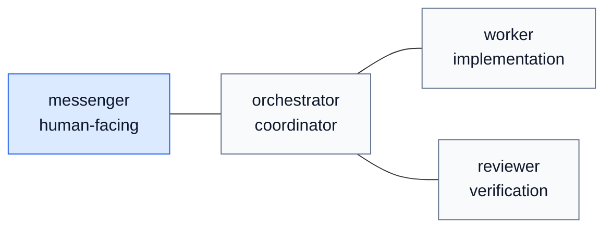
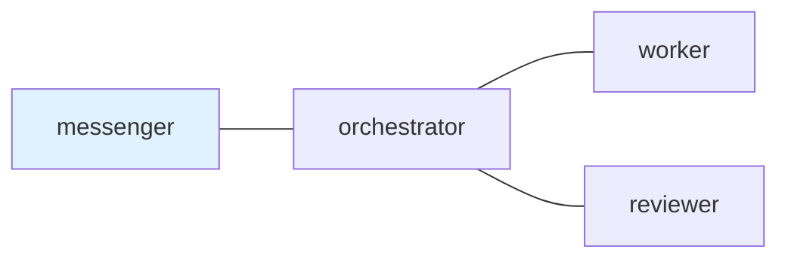

# tmux に置く最小限のエージェント組織図
uma-chan
2026-07-21

## 1. 欲しかったグラフ

「Graph
Engineering」という言葉を、複数エージェント構成の文脈で見ることが増えてきた。まだ新しい言葉だが、向いている方向は分かりやすい。エージェントを長い一つの会話として扱うのではなく、登場人物を名付け、辺を名付け、引き継ぎを見えるようにする。

ただし、この語彙はすぐ大きくなりすぎる。グラフと言った瞬間に、ワークフロー実行基盤、サービス間プロトコル、プランナー、メッセージキュー、レビューシステム、単なる図が混ざる。

私が欲しかったグラフはもっと小さい。

欲しかったのは、ターミナル上のエージェントのローカルな地図だった。

- どの役割が人間と話すのか
- どの役割が作業を調整するのか
- どの役割が実装するのか
- どの役割がレビューするのか
- 誰が誰に話してよいのか
- どの依頼がまだ返信待ちなのか

`tmux-a2a-postman` が与えるのは、この形である。LangGraph や AutoGen
の代替ではない。A2A プロトコルの実装でもない。tmux
ペインのための、Markdown で書くローカルな会話トポロジーである。

Repository: <https://github.com/i9wa4/tmux-a2a-postman>

## 2. 実行グラフと会話トポロジー

ここは分けておきたい。

[LangGraph の Graph
API](https://docs.langchain.com/oss/python/langgraph/graph-api)
は、エージェントのワークフローを state、nodes、edges
でモデル化する。node はロジックを実行して state の更新を返す。edge
は次にどの node を実行するかを決める。これは実行構造である。

[AutoGen
GraphFlow](https://microsoft.github.io/autogen/stable/user-guide/agentchat-user-guide/graph-flow.html)
も、エージェントを node、許可された実行経路を edge
とする有向グラフを説明している。順次、並列、条件分岐、ループを扱う。

[Google ADK workflows](https://adk.dev/workflows/)
は、より予測可能で信頼しやすいシステムのために、複数エージェント、複数
node のアプリケーションを扱う。[A2A の説明](https://adk.dev/a2a/intro/)
は、サービス、チーム、言語、フレームワークをまたいでエージェントが通信するための話である。

これらは postman より強く、広い面を持っている。

`tmux-a2a-postman` は、グラフ実行基盤の中で node を実行しない。node
は、すでに動いている tmux ペインである。edge
は、許可された会話経路である。message は Markdown メールである。daemon
は配送、未読と既読、返信必須の依頼、状態を追跡する。

だから比較するなら、もっと狭く言うのがよい。postman
は、ローカルなターミナルエージェントチームの組織図、または会話トポロジーである。

## 3. 小さなトポロジー

最小限で役に立つ構成は、図としては地味である。そこがよい。



`postman.md` では、同じ内容を普通の Markdown として書く。

<div class="code-with-filename">

**postman.md**

```` markdown
## `edges`



## `messenger`

### `role`

Human-facing transport role. Relay work to orchestrator.

## `orchestrator`

### `role`

Coordinator. Delegate implementation to worker and request review from reviewer.

## `worker`

### `role`

Implementation role. Return changed files, checks, evidence, and blockers.

## `reviewer`

### `role`

Verification role. Check the result and return an evidence-backed verdict.
````

</div>

重要なのは装飾ではない。node
名はペインタイトルと役割契約に対応する。`---` の edge
は、どの役割がどの役割へメールを送れるかを定義する。`ui_node` class
は、最初に人間へ向く役割を示す。

これだけで、ペインの記憶に頼る状態からかなり抜けられる。

## 4. なぜメールボックスがグラフに要るのか

役割のグラフは、仕事がその上を消えずに流れる場合にだけ役に立つ。

ターミナルエージェントには、すでに実行面がある。shell、editor、test
command、repository file、長く生きる tmux pane
がある。消えやすいのは引き継ぎである。依頼は一つの chat history
にあり、reviewer は別の pane
で答える。後で人間が「何がまだ開いているのか」と聞くと、みんなで
scrollback を読むことになる。

postman は、引き継ぎをローカルな状態に変える。

message には sender と receiver がある。receiver は `pop` で claim
する。ある message は送るだけでよい。別の message は reply-required
で、正確な input request を開く。完了返信には、evidence、task
artifact、original checklist status、remaining blockers を書く。

小さい仕組みだが、運用モデルは変わる。グラフは「orchestrator は worker
と話せる」だけではなくなる。「orchestrator がこの依頼を worker
に送り、worker が claim し、この返信 slot がまだ開いている」になる。

グラフは記憶を持つ調整地図になる。

## 5. 今の議論の中での位置

エージェントの議論は、prompt から loop、workflow、organization
へ上がっている。

[「Loop EngineeringはGraph
Engineeringの中にある」](https://aimanavo.com/c/morphox_ai/a/MAfrDjpPkKGUFw)
は、エージェントを組織として配線する話として Graph Engineering
を扱っている。[TrueFoundry の Graph Engineering
記事](https://www.truefoundry.com/blog/graph-engineering-enterprise-guide)
も、topology、router、join、tool、human
checkpoint、governance、observability を設計対象として扱う。

これらは、仕様というより潮流を示す記事として読むのがよい。より安定した参照先は、やはり
framework docs である。LangGraph、AutoGen、ADK
のドキュメントを見ると、node、edge、routing、fan-out、複数エージェント
workflow の語彙は、すでに agent engineering の普通の部品になっている。

postman は、その中では org graph 側に寄っている。次の node を決める
planner を提供しない。state graph を実行しない。遠隔サービス間の agent
communication を標準化しない。一方で、ローカルな組織を読める形にする。

- 安定した役割
- 宣言された引き継ぎ edge
- 人間向けの入口 node
- Markdown の role contract
- 永続する mail
- 明示的な reply obligation
- 人間も別の agent も読める status

これは、ターミナルサイズの Graph Engineering である。

## 6. 役に立つ制約

一番役に立つ制約は、グラフを地味に保つことだ。

エージェント組織図は、最初から二十個の役割を持つべきではない。私の場合は、たいてい四つから始める。

- `messenger` が人間と話す
- `orchestrator` が仕事を形にして経路を決める
- `worker` が変更や調査をする
- `reviewer` が証跡を確認する

必要になれば、approver、critic、operator、release coordinator
を足せばよい。ただし小さなグラフだけでも、一つの context window
に同居しにくい責務を分けられる。

worker は、人間と話す手順を覚えなくてよい。reviewer は、worker
の私的な推論全体を抱えなくてよい。messenger は repository
を調べなくてよい。orchestrator
は、すべての編集を自分で実行しなくてよい。

edge list は、context の圧力を逃がす弁である。

## 7. 正直な境界

安全境界も書いておく。

postman は調整であって、強制ではない。宣言された edge は process を
sandbox しない。command approval thread は OS の permission model
ではない。Markdown の role contract は、agent
が必ずその通りに振る舞う証明ではない。

これは脚注ではない。比較を正直に保つための中心である。

runtime sandbox、permission、hook、CI、branch
protection、人間の承認が必要な場所では、それらを使うべきだ。postman
は、postman が得意なことに使う。ローカルな agent
の引き継ぎを明示し、点検でき、ひとつの model context
を越えて残る状態にすることだ。

Markdown のグラフが実行 framework
を置き換えるわけではない。価値は、より重い仕組みが必要になる前に、ローカルな組織を見えるようにすることにある。

## 8. なぜ見せる価値があるのか

この記事の元になった README の変更では、rendered topology のすぐ近くに
Mermaid source を置いた。小さな変更だが、プロダクトの考え方はよく出る。

図は言う。これが組織である。

source は言う。これが編集できる契約である。

mailbox は言う。これが起きたことである。

今のところ、これが私の見つけた最小限で役に立つエージェント組織図である。tmux
に収まるのは、最初の問題が分散グラフを実行することではないからだ。最初の問題は、次の
message を誰が持っているのかを知ることである。

## Sources

- [`tmux-a2a-postman`](https://github.com/i9wa4/tmux-a2a-postman)
- [LangGraph Graph
  API](https://docs.langchain.com/oss/python/langgraph/graph-api)
- [LangGraph workflows and
  agents](https://docs.langchain.com/oss/python/langgraph/workflows-agents)
- [AutoGen
  GraphFlow](https://microsoft.github.io/autogen/stable/user-guide/agentchat-user-guide/graph-flow.html)
- [Google ADK workflows](https://adk.dev/workflows/)
- [Google ADK A2A introduction](https://adk.dev/a2a/intro/)
- [Loop EngineeringはGraph
  Engineeringの中にある](https://aimanavo.com/c/morphox_ai/a/MAfrDjpPkKGUFw)
- [TrueFoundry: Graph Engineering for Multi-Agent
  Systems](https://www.truefoundry.com/blog/graph-engineering-enterprise-guide)

<div class="social-share"><a href="https://twitter.com/share?url=https%3A%2F%2Fi9wa4.github.io%2Fblog%2F2026-07-21-agent-org-graph-in-tmux.html&text=tmux%20%E3%81%AB%E7%BD%AE%E3%81%8F%E6%9C%80%E5%B0%8F%E9%99%90%E3%81%AE%E3%82%A8%E3%83%BC%E3%82%B8%E3%82%A7%E3%83%B3%E3%83%88%E7%B5%84%E7%B9%94%E5%9B%B3%20%E2%80%93%20uma-chan%E2%80%99s%20page" target="_blank" class="twitter"><i class="bi bi-twitter-x"></i></a><a href="https://bsky.app/intent/compose?text=tmux%20%E3%81%AB%E7%BD%AE%E3%81%8F%E6%9C%80%E5%B0%8F%E9%99%90%E3%81%AE%E3%82%A8%E3%83%BC%E3%82%B8%E3%82%A7%E3%83%B3%E3%83%88%E7%B5%84%E7%B9%94%E5%9B%B3%20%E2%80%93%20uma-chan%E2%80%99s%20page%20https%3A%2F%2Fi9wa4.github.io%2Fblog%2F2026-07-21-agent-org-graph-in-tmux.html" target="_blank" class="bsky"><i class="bi bi-bluesky"></i></a><a href="https://www.linkedin.com/shareArticle?url=https%3A%2F%2Fi9wa4.github.io%2Fblog%2F2026-07-21-agent-org-graph-in-tmux.html&title=tmux%20%E3%81%AB%E7%BD%AE%E3%81%8F%E6%9C%80%E5%B0%8F%E9%99%90%E3%81%AE%E3%82%A8%E3%83%BC%E3%82%B8%E3%82%A7%E3%83%B3%E3%83%88%E7%B5%84%E7%B9%94%E5%9B%B3%20%E2%80%93%20uma-chan%E2%80%99s%20page" target="_blank" class="linkedin"><i class="bi bi-linkedin"></i></a></div>
