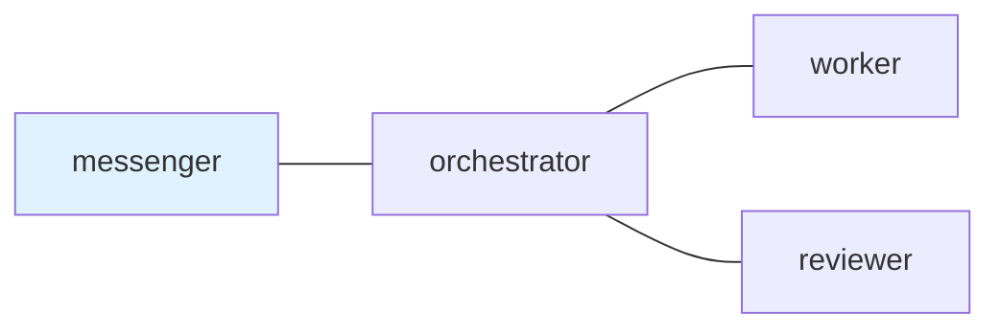

## 1. The Missing Layer

This article is for people who use AI coding agents and are starting to care about durable instructions, explicit handoffs, reviewable task state, or mixing more than one terminal agent or tool in the same workflow.

You might already use Codex CLI, Claude Code, or another agent runtime, including native subagents, team features, or task delegation where they are available. Keep using them when they solve the problem. tmux-a2a-postman is about a different surface: a small local mailbox for handoffs that should stay visible outside one long chat, one model runtime, or one vendor-specific feature.

The pain I am solving is role overload. A single lead agent can become planner, implementer, reviewer, coordinator, memory keeper, and status reporter at once. Native subagents help narrow the work, but durable handoffs still need a place to live when work crosses runtime boundaries, lasts longer than one context window, or needs evidence that another role can inspect later.

In my local setup, tmux and `vde-layout` give me the physical workspace: long-lived panes, repeatable layouts, and a user-facing `ui_pane` so the human does not need to become a tmux operator for every task. That workspace is useful, but it is not a coordination protocol.

The missing layer is the handoff surface:

- who may talk to whom
- what request was delivered
- which context entered the next agent's window
- whether the receiver claimed it
- whether a reply is required
- what evidence remains later

tmux-a2a-postman is my small local answer to that gap.

Repository: <https://github.com/i9wa4/tmux-a2a-postman>

## 2. The Core Task Route

Postman runs as a resident daemon in a tmux pane:

```{.bash}
tmux-a2a-postman start
```

A trimmed and anonymized view looks like this. The project names are synthetic, but the emoji/status-marker style follows the current daemon output:

```{.text}
tmux-a2a-postman git-b2c8283   [up/down:move] [p:ping] [q:quit]

[sessions]
  ⚫ [0] shell
> 🟡 [1] article-edit
  🟢 [2] docs-review
  🔷 [3] runtime-workbench

[nodes]
messenger     🟡  waiting
orchestrator  🔷  pending
worker        🟢  ready
guardian      🟢  ready
critic        🟢  ready
boss          🟢  ready
```

The important part is not the dashboard itself. Once a task is handed off, postman keeps the route and reply obligation outside terminal scrollback: messenger to orchestrator to worker to reviewer to messenger can be a Markdown-defined path instead of a human remembering which pane should answer next. Agent Skills add local operating rules for each role when they materially help.

The compact heartbeat is deliberately dense:

```{.text}
[0]⚫ [1]🟡:🟡🔷🟢🟢🟢🟢 [2]🟢:🟢🟢🟢🟢🟢🟢 [3]🔷:🔷🟢🟢🟢🟢🟢
```

I use `get-status` for full inspection and `get-status-oneline` for a status-bar-sized heartbeat. This is the concrete value: I can see that mail is moving, a reply is still open, or a role is waiting without treating the agent panes as the source of truth.

The [README quick start](https://github.com/i9wa4/tmux-a2a-postman#quick-start) is still the right place for installation and command details. The article-level point is smaller: postman turns terminal-agent handoffs into visible local state.

## 3. What It Is

tmux-a2a-postman is a local mailbox and coordination layer for terminal agents, implemented on top of tmux.

It does not create the model, write the code, isolate a container, or decide a workflow by itself. It delivers Markdown messages between role-labeled terminal panes, records unread and read mail, tracks reply-required obligations, and exposes status.

The value spine is simple: turn "I told that agent something" into "there is a Markdown mail item with a sender, receiver, inbox/read state, and an exact reply slot when one is required."

| Before postman                          | With postman                                |
| --------------------------------------- | ------------------------------------------- |
| Requests live in one chat or pane       | Requests are delivered as Markdown mail     |
| Handoff context is whatever is nearby   | Handoff context is chosen for this request  |
| Replies are inferred from terminal text | Required replies close exact input requests |
| Old constraints live in chat history    | Current constraints travel with the handoff |
| Routing rules are team convention       | Routing and role contracts are Markdown     |

This is not internal agent memory. It does not make an agent remember everything. It makes pending work, delivered mail, unread/read state, reply obligations, and delivery evidence visible as local state.

For larger investigation notes, I use a separate Markdown artifact workflow such as [`mkmd`](2026-03-22-mkmd-mktemp-wrapper-for-ai-agents.qmd). The two fit well together, but they are not the same layer.

## 4. postman.md as the Control Surface

The center of the setup is `postman.md`.

It is a Markdown file that humans can review and agents can read. It can contain the team topology, role instructions, shared rules, and Agent Skills catalog references.

This is the part I usually want outside a native model feature. A runtime may provide its own subagents or task tools, but `postman.md` is a local Markdown contract I can review in Git and apply across terminal tools. Behavior changes by editing Markdown, not by writing framework code; that keeps orchestration readable, versionable, and easy for an AI agent to patch in a normal diff.

A compact synthetic `postman.md` can show the moving parts without exposing private workflow details:

````{.markdown filename="postman.md"}
---
skill_path:
  - path: ~/.codex/skills
    inject: ping
    skills:
      - postman-session-operator
      - postman-send-message
---

## `edges`



## `common_template`

Use postman mail for handoffs. Required work ends with DONE or BLOCKED and evidence.

## `orchestrator`

### `role`

Coordinator. Delegate implementation to `worker` and request review from `reviewer`.

## `worker`

### `role`

Implementation role. Reply with changed files, validation, and blockers.

## `reviewer`

### `role`

Review role. Return evidence-backed APPROVED or NOT APPROVED.
````

Rendered, the same `edges` section is intentionally small:

```{mermaid}
graph LR
    messenger["messenger"]
    orchestrator["orchestrator"]
    worker["worker"]
    reviewer["reviewer"]

    messenger --- orchestrator
    orchestrator --- worker
    orchestrator --- reviewer

    class messenger entry
    class orchestrator,worker,reviewer role
    classDef entry fill:#dbeafe,stroke:#2563eb,color:#0f172a
    classDef role fill:#f8fafc,stroke:#64748b,color:#0f172a
```

The diagram is not decoration. The node names and `---` edges define which roles may talk to each other. With `inject: ping`, the `skill_path` block injects a compact Agent Skills catalog into recurring daemon PING role content, while the role sections keep the review loop and reply expectations local to Markdown. Postman only treats a small parsed subset as routing and Agent Skills catalog data; the rest stays useful as human-readable role context.

Each received mail item carries the relevant `postman.md` instructions with the request: role context, routing expectations, reply shape, and available Agent Skills when configured. That matters over longer tasks because the receiving agent can re-read its local contract instead of relying on nearby pane history.

A review loop can then stay in mail instead of terminal scrollback:

```{.text}
messenger -> orchestrator: tighten the article and validate it

orchestrator -> worker: make the scoped edit

worker -> orchestrator: DONE with changed files and checks

orchestrator -> reviewer: verify before user-facing completion

reviewer -> orchestrator: APPROVED or NOT APPROVED with evidence
```

This block is not displayed by tmux-a2a-postman's TUI. It is a compact example of Markdown mail handoff and reply shape.

That does not make the result correct by itself. It makes three kinds of forgetting harder: role drift, dropped reply-required loops, and forgotten local capabilities. `postman.md` carries role and routing expectations with the mail, reply-required keeps open loops visible, and the Agent Skills catalog gives the receiver compact names and descriptions for local capabilities it can choose when needed.

The full `SKILL.md` body stays out of the prompt until the task actually needs it. The catalog is a reminder to use known local behavior before improvising.

## 5. The Mail Handoff Agents Can Operate

The mail handoff is intentionally small: one role sends Markdown mail, the receiver claims it, reads the archived body, and answers required requests with `DONE` or `BLOCKED` plus evidence.

tmux-a2a-postman's own Agent Skills make the handoff operational: sender roles learn the heredoc send path; receiver roles learn that archived mail must be read, required replies must close exact input requests, and blocked or delivery failures must be reported. `postman-config-auditor` covers topology and config checks when routes or role definitions need review.

This closes transport state, not truth. A `DONE` reply still needs evidence. A reviewer, orchestrator, or human can inspect changed files, test output, and the task artifact before accepting the result.

## 6. Why tmux-Native

Postman is intentionally tmux-native today. That is an implementation choice, not the reader identity.

It uses tmux-specific surfaces: session, window, and pane discovery; operator-controlled pane titles as role labels and routing keys; tmux input delivery; pane capture for bounded activity evidence; and tmux pane metadata.

Those are implementation facts, not universal claims about terminal tools. The portable ideas are shell-first operation, local filesystem mail, human-reviewable Markdown contracts, heterogeneous CLI agents side by side, and visible handoff state.

So the comparison I care about is category-level:

| Category                         | What it usually solves                     |
| -------------------------------- | ------------------------------------------ |
| Native agent features            | In-runtime delegation, subagents, tool use |
| Agent runtime                    | Thinking, editing, tool execution          |
| Terminal multiplexer substrate   | Long-lived panes, sessions, input surfaces |
| Workspace layout harness         | Recreate the physical workspace            |
| Mailbox and coordination layer   | Handoffs, unread state, replies, receipts  |

Postman lives in the last row and currently runs on tmux.

## 7. Boundaries and Composition

tmux-a2a-postman is not an AI coding agent, a full multi-agent framework, a workflow engine, a sandbox, an MCP server, an A2A-compliant server, or a replacement for Claude Code, Codex CLI, tmux, or `vde-layout`.

The name uses `a2a` in the agent-to-agent handoff sense and borrows useful A2A-style vocabulary for messages, contexts, artifacts, and input-required states. It is not currently a standards-compliant A2A endpoint.

I use native subagents or team features for work inside one runtime, tmux for the workbench, `vde-layout` for repeatable pane creation, Agent Skills or local instructions for role behavior, `mkmd` for larger task artifacts, and postman for handoffs between terminal roles and tools.

Each layer can be replaced or improved without pretending one tool should own everything. The transport cares about pane titles, shell commands, and local mail files, not a specific model vendor or agent API. Claude Code, Codex CLI, Gemini CLI, OpenCode, or another terminal agent can sit behind the same role name as long as it can read mail, act, and reply.

## 8. Summary

Terminal agents can already think, edit, run commands, and sometimes delegate to native subagents or team features. Keep those capabilities.

The missing piece is the local handoff layer: who may talk to whom, what was delivered, what remains unread, who owes a reply, and what evidence remains when delivery or task completion needs inspection.

tmux-a2a-postman is a mailbox, not a brain. It is a receipt layer, not a proof of correctness. It is Markdown-forward, not attachment-based. It is tmux-native today, while the core idea is portable: local agents work better when handoffs are explicit, reviewable, and recoverable.
