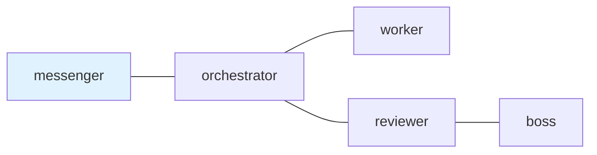

## 1. The Missing Layer

This article is for people who use AI coding agents and are starting to care about durable instructions, explicit handoffs, reviewable task state, or mixing more than one terminal agent or tool in the same workflow.

You might already use Codex CLI, Claude Code, or another agent runtime, including native subagents, team features, or task delegation where they are available. Keep using them when they solve the problem. `tmux-a2a-postman` is about a different surface: a small local mailbox for handoffs that should stay visible outside one long chat, one model runtime, or one vendor-specific feature.

The pain I am solving is not "native agent features are missing." It is role overload. A single lead agent can become planner, implementer, reviewer, coordinator, memory keeper, and status reporter at once. Native subagents help narrow the work, but durable handoffs still need a place to live when work crosses runtime boundaries, lasts longer than one context window, or needs evidence that another role can inspect later.

The practical value is input-surface control, not control over model internals. At each handoff, I can choose the current instructions, constraints, evidence, and references that enter the next agent's context window. That makes the handoff explicit and reviewable, and it reduces the chance that old, diluted, or forgotten instructions drive the next step.

The same is true for behavior. Roles, routing, and reply contracts live in Markdown, so orchestration stays readable, editable, versionable, and easy for an agent to update in a normal diff.

In the previous article, I described my tmux and `vde-layout` workflow for creating repeatable local workspaces for CLI agents:

[Build Repeatable tmux Workspaces for CLI Agents with vde-layout](2026-05-17-repeatable-tmux-workspaces-for-ai-agents.qmd)

You do not need to start there to understand the idea here. The important point is that terminal agents need somewhere to run, and tmux is one practical local substrate for keeping those processes alive. That previous setup gives me the physical workspace:

- tmux sessions for projects
- tmux windows for groups of work
- tmux panes for long-running shells and agents
- `vde-layout` YAML for recreating the floor plan

That tmux-native choice matters because it gives me durable local panes, processes, and sessions without making the workflow depend on one vendor runtime. It also gives practical control over the input and handoff surface across different terminal agents and tools. This does not mean the reader needs to become a tmux power user: in my intended workflow, `vde-layout` manages the workspace shape, the human mostly talks to the user-facing `ui_pane`, and postman keeps handoff state explicit.

But a workspace is not a coordination protocol.

Here is the failure mode.

A coding task starts in Codex CLI, Claude Code, or another terminal agent with precise constraints. Later, another terminal agent, reviewer role, or different tool needs to continue part of the work. The task appears on screen, but later it is unclear whether the receiver claimed it, whether a reply is required, and which later `DONE` message closes that exact request. After enough context-heavy turns, the original constraints still exist somewhere in history, but they are no longer the active handoff surface.

That is where role quality degrades. The agent that should be focused on implementation is also remembering process rules. The reviewer is reconstructing intent from a chat transcript. The coordinator is tracking state by watching panes and remembering who promised what.

Once several agents, roles, or tools are involved, the hard questions move up a layer:

- Who is allowed to talk to whom?
- What role does each participant have?
- Was a request delivered?
- Has the receiver claimed it?
- Is a reply required?
- Which reply closes which request?
- What can I inspect after something goes wrong?

Without a handoff layer, the usual fallback is copy-paste, terminal input automation, chat history, and memory. That works until it does not.

The missing layer is not more memory. It is a handoff surface: a way to make the current request, receiver, reply obligation, and evidence visible at the moment work changes hands.

`tmux-a2a-postman` is my attempt to keep the useful parts of tmux while adding that missing handoff layer.

Repository: <https://github.com/i9wa4/tmux-a2a-postman>

## 2. What It Is

`tmux-a2a-postman` is a local mailbox and coordination layer for terminal agents, implemented on top of tmux.

It does not create the model, write the code, isolate a container, or decide a workflow by itself. It delivers Markdown messages between role-labeled terminal panes, records unread and read mail, tracks reply-required obligations, and exposes status.

It also does not compete with native subagent or team features. Those features are useful inside their own runtime. Postman is for the local operating layer around terminal agents: durable instructions, explicit handoffs, a deliberate context surface, role contracts that keep each agent narrower, and evidence that remains inspectable as local Markdown and filesystem state.

The value spine is simple: turn "I told that agent something" into "there is a Markdown mail item with a sender, receiver, inbox/read state, and an exact reply slot when one is required."

| Before postman                          | With postman                                |
| --------------------------------------- | ------------------------------------------- |
| Requests live in one chat or pane       | Requests are delivered as Markdown mail     |
| Handoff context is whatever is nearby   | Handoff context is chosen for this request  |
| Replies are inferred from terminal text | Required replies close exact input requests |
| Old constraints live in chat history    | Current constraints travel with the handoff |
| Routing rules are team convention       | Routing and role contracts are Markdown     |
| Behavior drifts across prompts          | Behavior is versioned as Markdown           |

This is a thin local harness, not a platform. It sits around terminal agents, uses tmux as the transport substrate, records small pieces of local state, and leaves thinking, editing, testing, and review to the tools already doing that work.

The stack looks like this:

| Layer                 | Responsibility                                      |
| --------------------- | --------------------------------------------------- |
| Native agent features | In-runtime delegation, subagents, tool use          |
| Agent runtime         | Think, edit, run commands                           |
| tmux                  | Keep long-lived panes and sessions alive            |
| `vde-layout`          | Recreate the physical workspace                     |
| `tmux-a2a-postman`    | Deliver mail, track replies, expose handoff state   |
| `mkmd` or work notes  | Hold larger investigation and task evidence         |

That last distinction matters. Postman is not internal agent memory. It does not make an agent remember everything. It makes pending work, delivered mail, unread/read state, reply obligations, and delivery evidence visible as local state.

For longer investigation notes, I use a separate Markdown artifact workflow such as [`mkmd`](2026-03-22-mkmd-mktemp-wrapper-for-ai-agents.qmd). The two fit well together, but they are not the same layer.

## 3. Why a Mailbox

The mailbox metaphor is boring in the best way.

When one agent sends work to another, I want a few facts to be durable:

- A message was submitted.
- It had a sender and receiver.
- It was delivered or dead-lettered.
- The receiver claimed it from the inbox.
- If a reply was required, an exact reply slot was opened.
- A later reply filled that exact slot.

That is different from pushing text into a terminal.

Direct terminal input automation such as `tmux send-keys` is useful, but it is not a handoff ledger by itself. If the recipient misses the text, if the pane is busy, or if a reply is expected later, the operator has to reconstruct intent from screen state and memory.

Postman turns handoffs into local mail.

## 4. postman.md as the Control Surface

The center of the setup is `postman.md`.

It is a Markdown file that humans can review and agents can read. It can contain the team topology, role instructions, shared rules, and skill catalog references.

This is the part I usually want outside a native model feature. A runtime may provide its own subagents or task tools, but `postman.md` is a local Markdown contract I can review in Git and apply across terminal tools. Behavior changes by editing Markdown, not by writing framework code; that keeps orchestration readable, versionable, and easy for an AI agent to patch in a normal diff.

A minimal topology can be written as Mermaid:

```{mermaid}
graph LR
    messenger --- orchestrator
    orchestrator --- worker
    orchestrator --- reviewer
    reviewer --- boss
    class messenger ui_node
    classDef ui_node fill:#e0f2fe
```

The copyable source is just a `postman.md` section:

````{.markdown filename="postman.md"}
## `edges`


````

The diagram is not just decoration. The node names and `---` edges define which roles may talk to each other. Postman only treats a small parsed subset as routing data; the rest stays useful as human-readable diagram context.

The same Markdown file can also carry operating rules:

```{.markdown filename="postman.md"}
## `worker`

### `role`

Primary implementation role.

### Reply Contract

Before replying DONE, include:

- changed files
- validation results
- evidence
- remaining blockers
```

That role contract changes output quality. Without a contract, a worker can drift toward a vague reply:

```{.text}
DONE. Fixed.
```

With a contract, the reply has a shape that an orchestrator or reviewer can check:

```{.text}
DONE: Parser behavior tightened.

Changed files:
- internal/parser/example.go

Validation:
- go test ./...

Remaining blockers: none
```

That is why I like Markdown for this layer. The coordination contract is partly structured data and partly natural-language procedure. TOML or YAML are good for numeric defaults. Markdown is better for a reviewable role contract.

It also keeps the control surface close to normal Git review. A change to the team topology or DONE criteria appears as a normal diff.

Skill catalogs fit the same idea, but the value is not only prompt size or discovery. In a long-running conversation, an agent can lose track of when a local skill applies and improvise even though the repository already has operating rules. A role can receive a compact list of relevant skills with names and descriptions, while the full `SKILL.md` body stays out of the prompt until the task actually needs it. That list acts as a role and task reminder: use the known local rule before guessing, while keeping the handoff readable and reviewable.

That matters because postman does not prescribe a single team shape. You can define roles, routes, reply expectations, and operating rules in Markdown, then revise them as the workflow changes. A postman-specific skill such as `postman-config-auditor` gives agents local knowledge for auditing that topology and suggesting scoped refinements, so the harness can become more tailored without the user explaining every rule each time.

## 5. The Mail Loop Agents Can Operate

The runtime loop is intentionally small: one role sends Markdown mail, the receiver claims it, reads the archived body, and answers required requests with `DONE` or `BLOCKED` plus evidence. The README covers the command syntax; the article-level point is the state model: delivered mail, claimed mail, archived body, and exact reply closure.

This is where skill catalogs become operational rather than decorative. A receiver that has `postman-session-operator` in its relevant skills can know when to claim mail, how to treat the archive, how to close an exact input request, and when to report blocked or delivery trouble. A config-focused role with `postman-config-auditor` can inspect the topology and help refine roles, routes, and rules as the user's preferred workflow evolves.

The skills do not make the agent magically autonomous. They provide local operating knowledge. The task mail still carries the current constraints, reply policy, success checks, and artifact references, especially for long-running implementation, review, or approval work.

This closes transport state, not truth. A `DONE` reply still needs evidence. A reviewer, orchestrator, or human can inspect changed files, test output, and the task artifact before accepting the result.

## 6. Status Without Collapsing Meaning

In a long-running session, silence is ambiguous.

An agent may be working. It may be waiting for a reply. It may have unread mail. It may be stale. Delivery may have failed.

Status exists so the operator does not have to guess from screen state alone.

The key is not the full taxonomy. The key is that different states imply different operator decisions.

| Status clue        | Operational meaning                                      |
| ------------------ | -------------------------------------------------------- |
| `pending`          | The receiver still needs to claim and read input         |
| `waiting`          | A required request is still open                         |
| `delivery_failure` | Inspect routing, pane identity, or dead-letter state     |
| `blocked`          | The task state is different from transport delivery      |

This split matters. `pending` is not the same as `blocked`. `waiting` is not the same as `delivery_failure`. If a dashboard turns all of these into one red/green light, it loses the information needed to decide whether to wait, follow up, or recover delivery.

## 7. Why tmux-Native

Postman is intentionally tmux-native today. That is an implementation choice, not the reader identity.

It uses tmux-specific surfaces:

- session, window, and pane discovery
- operator-controlled pane titles as mutable role labels and routing keys
- tmux input delivery
- pane capture for bounded activity and progress evidence
- tmux pane and session metadata

Those are implementation facts, not universal claims about terminal tools.

The portable ideas are different:

- shell-first operation
- local filesystem mail
- human-reviewable Markdown contracts
- heterogeneous CLI agents side by side
- visible handoff state

Other substrates may support similar ideas in their own way. This implementation deliberately exploits tmux because tmux already gives a scriptable local process model that works well for long-lived CLI agents.

So the comparison I care about is category-level:

| Category                         | What it usually solves                     |
| -------------------------------- | ------------------------------------------ |
| Terminal multiplexer substrate   | Long-lived panes, sessions, input surfaces |
| Editor-integrated terminal       | Terminal access inside an editor workspace |
| AI editor or agent runtime       | Thinking, editing, tool execution          |
| Workflow harness                 | Spawning, assigning, or supervising work   |
| Mailbox and coordination layer   | Handoffs, unread state, replies, receipts  |

Postman lives in the last row and currently runs on the first row.

## 8. What It Is Not

The boundaries are important.

`tmux-a2a-postman` is not:

- an AI coding agent
- a full multi-agent framework
- a workflow engine
- a sandbox
- an MCP server
- an A2A-compliant server
- a reason to abandon native subagent or team features
- a replacement for tmux or `vde-layout`
- a replacement for Claude Code, Codex CLI, or other agent runtimes

The name contains `a2a` because A2A-style vocabulary is useful for thinking about messages, contexts, artifacts, and input-required states. But this is a local tmux and filesystem coordination runtime, not a standards-compliant A2A endpoint.

That honesty is part of the design. The tool is small because it stays in its lane. Use native runtime features where they are enough; add postman when you want a tool-neutral local record of handoffs, obligations, and evidence.

## 9. Where It Composes

The interesting part is composition.

I can use:

- native subagents or team features for work inside one runtime
- tmux for the workbench
- `vde-layout` for repeatable pane creation
- worktrees or containers for isolation
- Claude Code, Codex CLI, Gemini CLI, OpenCode, or another CLI agent for execution
- skills or local instructions for agent behavior
- `mkmd` for larger task artifacts
- postman for handoffs between terminal roles and tools

Each layer can be replaced or improved without pretending one tool should own everything.

That is the "loose harness engineering" shape I like. The harness does not need to be a giant platform. It can be a set of small, inspectable tools with clear boundaries.

The vendor-neutral part comes from the boundary. The transport cares about pane titles, shell commands, and local mail files, not a specific model vendor or agent API. Claude Code, Codex CLI, Gemini CLI, OpenCode, or another terminal agent can sit behind the same role name as long as it can read mail, act, and reply.

## 10. A Small Runtime Loop

The mental model is simple: terminal processes are work locations, tmux panes keep them addressable, and postman mail is the handoff record between those locations.

This article is not the full setup manual. The README is still the right place for installation, complete config, and edge cases. But the first runnable shape should be easy to picture:

1. Keep using the agent runtime's native features for work they handle well.
2. Put terminal agents or tools that need durable cross-tool handoffs in tmux panes.
3. Use `postman.md` to name roles, allowed handoff edges, and role contracts.
4. Let postman mail carry the handoff, reply obligation, archived body, and status surface.

The daemon itself stays resident in a pane:

```{.bash}
tmux-a2a-postman start
```

A trimmed and anonymized view looks like this:

```{.text}
tmux-a2a-postman git-b2c8283   [up/down:move] [p:ping] [q:quit]

[sessions]
> [1] project-workbench
  [2] docs-review

[nodes]
messenger     ready
orchestrator  waiting
worker        ready
guardian      ready
```

There is nothing magical in that loop.

That is the point. It is ordinary local state, ordinary Markdown, ordinary terminal panes, and explicit reply closure.

## 11. Summary

Terminal agents can already think, edit, run commands, and sometimes delegate to native subagents or team features.

Keep those capabilities. tmux can keep terminal agents alive side by side when you want a local, inspectable workbench. `vde-layout` can recreate that physical workspace.

The missing piece is the handoff layer: who may talk to whom, what was delivered, what remains unread, who owes a reply, and what evidence remains when delivery or task completion needs inspection.

`tmux-a2a-postman` is my small local answer to that gap.

It is a mailbox, not a brain. It is a receipt layer, not a proof of correctness. It is Markdown-forward, not attachment-based. It is tmux-native today, while the core idea is portable: local agents work better when handoffs are explicit, reviewable, and recoverable.
