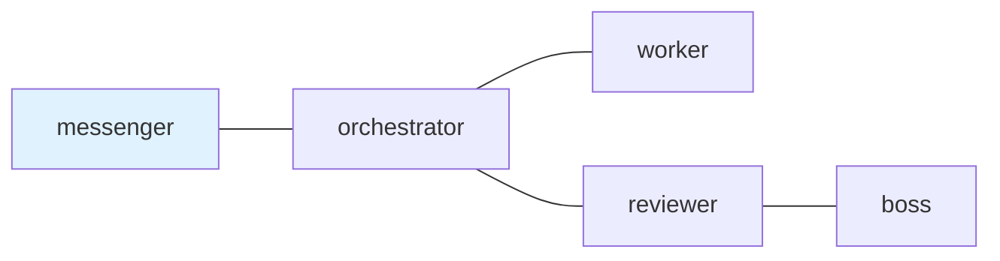

## 1. The Missing Layer

In the previous article, I described my tmux and `vde-layout` workflow for creating repeatable local workspaces for CLI agents:

[Build Repeatable tmux Workspaces for CLI Agents with vde-layout](/en/blog/2026-05-17-repeatable-tmux-workspaces-for-ai-agents.html)

That gives me the physical workspace:

- tmux sessions for projects
- tmux windows for groups of work
- tmux panes for long-running shells and agents
- `vde-layout` YAML for recreating the floor plan

But a workspace is not a coordination protocol.

Once several agents are alive, the hard questions move up a layer:

- Who is allowed to talk to whom?
- What role does each pane have?
- Was a request delivered?
- Has the receiver claimed it?
- Is a reply required?
- Which reply closes which request?
- What can I inspect after something goes wrong?

Without a handoff layer, the usual fallback is copy-paste, direct `tmux send-keys`, chat history, and memory. That works until it does not.

`tmux-a2a-postman` is my attempt to keep the useful parts of tmux while adding the missing handoff semantics.

Repository: <https://github.com/i9wa4/tmux-a2a-postman>

## 2. What It Is

`tmux-a2a-postman` is a local mailbox and coordination layer for already-running agents in tmux.

It does not create the model, write the code, isolate a container, or decide a workflow by itself. It delivers Markdown messages between role-labeled panes, records unread and read mail, tracks reply-required obligations, and exposes status.

The stack looks like this:

| Layer                | Responsibility                                      |
| -------------------- | --------------------------------------------------- |
| Agent runtime        | Think, edit, run commands                           |
| tmux                 | Keep long-lived panes and sessions alive            |
| `vde-layout`         | Recreate the physical workspace                     |
| `tmux-a2a-postman`   | Deliver mail, track replies, expose handoff state   |
| `mkmd` or work notes | Hold larger investigation and task evidence         |

That last distinction matters. Postman is not internal agent memory. It does not make an agent remember everything. It makes pending work, delivered mail, unread/read state, reply obligations, and delivery evidence visible as local state.

For longer investigation notes, I use a separate Markdown artifact workflow such as [`mkmd`](/en/blog/2026-03-22-mkmd-mktemp-wrapper-for-ai-agents.html). The two fit well together, but they are not the same layer.

## 3. Why a Mailbox

The mailbox metaphor is boring in the best way.

When one agent sends work to another, I want a few facts to be durable:

- A message was submitted.
- It had a sender and receiver.
- It was delivered or dead-lettered.
- The receiver claimed it from the inbox.
- If a reply was required, an exact reply slot was opened.
- A later reply filled that exact slot.

That is different from pushing text into a pane.

Direct `tmux send-keys` is useful for automation, but it is not a handoff ledger by itself. If the recipient misses the text, if the pane is busy, or if a reply is expected later, the operator has to reconstruct intent from screen state and memory.

Postman turns handoffs into local mail.

## 4. postman.md as the Control Surface

The center of the setup is `postman.md`.

It is a Markdown file that humans can review and agents can read. It can contain the team topology, role instructions, shared rules, and skill catalog references.

A minimal topology can be written as Mermaid:



The diagram is not just decoration. The node names and edges define which roles may talk to each other.

The same Markdown file can also carry operating rules:

```markdown
## worker

You implement assigned tasks.

Before replying DONE, include:

- changed files
- validation results
- evidence
- remaining blockers
```

That is why I like Markdown for this layer. The coordination contract is partly structured data and partly natural-language procedure. TOML or YAML are good for numeric defaults. Markdown is better for a reviewable role contract.

It also keeps the control surface close to normal Git review. A change to the team topology or DONE criteria appears as a normal diff.

## 5. Markdown-Forward, Not Attachment-Based

The message body is Markdown.

The normal send shape is a quoted heredoc:

```bash
tmux-a2a-postman send-heredoc --to worker --reply-required <<'POSTMAN_BODY'
# Task

Implement the small refactor described below.

## Completion

Reply with DONE or BLOCKED.
Include changed files, validation, and remaining blockers.
POSTMAN_BODY
```

The quoted delimiter matters. Agent tasks often contain code fences, `$HOME`, command substitutions, backticks, and YAML. A quoted heredoc keeps the shell from expanding those pieces before the message is sent.

This is Markdown-forward, not attachment-based.

I am not claiming send-time Markdown attachment support. I am not relying on a body-file feature. The useful current shape is:

- send a Markdown body through `send-heredoc`
- have the daemon deliver it through the mailbox
- have `pop` move it to the read archive
- keep an archived Markdown mail file for later inspection

That gives long-form messages a safer surface without pretending the tool is an attachment system.

## 6. Reading Mail

The receiver does not just read text that was pasted into a pane. It claims mail.

```bash
tmux-a2a-postman pop
```

The `pop` command claims the oldest unread message for the current node, moves it from inbox to read archive, and returns metadata plus the archived Markdown path.

The important behavior is the state transition:

| Before `pop` | After `pop`       |
| ------------ | ----------------- |
| unread inbox | read archive mail |

For public examples, I prefer synthetic paths:

```text
$XDG_STATE_HOME/tmux-a2a-postman/<context>/<session>/read/msg_demo_001.md
```

That path shape communicates the idea without exposing a real machine path, session id, or operational archive.

Agents are expected to read the archived body before handling the message. The CLI metadata is not treated as the complete task when the archived body exists.

## 7. Reply Obligations

For multi-agent work, "please reply later" is too vague.

Postman models a required reply as an input request. Sending with `--reply-required` opens a reply obligation. The receiver's reply must fill that exact obligation.

Example reply:

```bash
tmux-a2a-postman send-heredoc \
  --to orchestrator \
  --reply-to message-demo-001.md \
  --fills-input-request-id INPUT_REQUEST_ID_PLACEHOLDER <<'POSTMAN_BODY'
DONE: Implemented the refactor and ran validation.

Changed files:
- src/example.ts

Validation:
- npm test

Remaining blockers: none
POSTMAN_BODY
```

The exact ids above are synthetic. The point is the relationship: this reply closes that request.

This closes transport state, not truth. A DONE reply still needs evidence. A reviewer, orchestrator, or human can inspect changed files, test output, and the task artifact before accepting the result.

That distinction prevents the mailbox from becoming a fake approval system. It tracks obligations and receipts. It does not magically prove that the work is correct.

## 8. Status Without Collapsing Meaning

In a long-running session, silence is ambiguous.

An agent may be working. It may be waiting for a reply. It may have unread mail. It may be stale. Delivery may have failed.

`tmux-a2a-postman get-status` exists so the operator does not have to guess from screen state alone.

The key is to keep different concepts separate.

Visible node state is about what the node appears to be doing:

| Visible state | Meaning                                      |
| ------------- | -------------------------------------------- |
| `initial`     | Node has not reached a ready projection yet  |
| `ready`       | No immediate input is pending                |
| `waiting`     | Node is waiting on a reply from someone else |
| `pending`     | Node has input it should handle              |
| `stale`       | Node has not shown recent enough progress    |

Session-level `unavailable` can appear as a fallback when a session cannot be inspected.

Severity and delivery health are separate:

| Field type | Examples                                               |
| ---------- | ------------------------------------------------------ |
| Severity   | `blocked`, `attention_stale`                           |
| Delivery   | `delivery_stuck`, `delivery_failure`                   |

This split matters. `stale` is not the same kind of fact as `delivery_failure`. `pending` is not the same as `blocked`. If a dashboard turns all of these into one red/green light, it loses the information needed to decide whether to wait, follow up, or recover delivery.

## 9. Why tmux-Native

Postman is intentionally tmux-native today.

It uses tmux-specific surfaces:

- session, window, and pane discovery
- operator-controlled pane titles as mutable role labels and routing keys
- tmux input delivery
- pane capture for bounded activity and progress evidence
- tmux pane and session metadata

Those are implementation facts, not universal claims about terminal tools.

The portable ideas are different:

- shell-first operation
- local filesystem mail
- human-reviewable Markdown contracts
- heterogeneous CLI agents side by side
- visible handoff state

Other substrates may support similar ideas in their own way. This implementation deliberately exploits tmux because tmux already gives a scriptable local process model that works well for long-lived CLI agents.

So the comparison I care about is category-level:

| Category                         | What it usually solves                     |
| -------------------------------- | ------------------------------------------ |
| Terminal multiplexer substrate   | Long-lived panes, sessions, input surfaces |
| Editor-integrated terminal       | Terminal access inside an editor workspace |
| AI editor or agent runtime       | Thinking, editing, tool execution          |
| Workflow harness                 | Spawning, assigning, or supervising work   |
| Mailbox and coordination layer   | Handoffs, unread state, replies, receipts  |

Postman lives in the last row and currently runs on the first row.

## 10. What It Is Not

The boundaries are important.

`tmux-a2a-postman` is not:

- an AI coding agent
- a full multi-agent framework
- a workflow engine
- a sandbox
- an MCP server
- an A2A-compliant server
- a replacement for tmux or `vde-layout`
- a replacement for Claude Code, Codex CLI, or other agent runtimes

The name contains `a2a` because A2A-style vocabulary is useful for thinking about messages, contexts, artifacts, and input-required states. But this is a local tmux and filesystem coordination runtime, not a standards-compliant A2A endpoint.

That honesty is part of the design. The tool is small because it stays in its lane.

## 11. Where It Composes

The interesting part is composition.

I can use:

- tmux for the workbench
- `vde-layout` for repeatable pane creation
- worktrees or containers for isolation
- Claude Code, Codex CLI, Gemini CLI, OpenCode, or another CLI agent for execution
- skills or local instructions for agent behavior
- `mkmd` for larger task artifacts
- postman for handoffs between already-running panes

Each layer can be replaced or improved without pretending one tool should own everything.

That is the "loose harness engineering" shape I like. The harness does not need to be a giant platform. It can be a set of small, inspectable tools with clear boundaries.

## 12. A Small Runtime Loop

A typical loop looks like this:

1. Create a repeatable tmux workspace with `vde-layout`.
2. Start the postman daemon for that session.
3. Send a Markdown task to a role with `send-heredoc`.
4. The receiver runs `pop`, reads the archived body, and does the work.
5. The receiver replies with `--fills-input-request-id` when required.
6. The orchestrator checks the task artifact and validation evidence.
7. `get-status` shows visible state plus severity and delivery fields, such as pending input, waiting replies, stale panes, blocked work, or delivery trouble.

There is nothing magical in that loop.

That is the point. It is ordinary local state, ordinary Markdown, ordinary tmux panes, and explicit reply closure.

## 13. Summary

Terminal agents can already think, edit, and run commands.

tmux can keep those agents alive side by side. `vde-layout` can recreate the physical workspace.

The missing piece is the handoff layer: who may talk to whom, what was delivered, what remains unread, who owes a reply, and what evidence remains when delivery or task completion needs inspection.

`tmux-a2a-postman` is my small local answer to that gap.

It is a mailbox, not a brain. It is a receipt layer, not a proof of correctness. It is Markdown-forward, not attachment-based. It is tmux-native today, while the core idea is portable: local agents work better when handoffs are explicit, reviewable, and recoverable.
