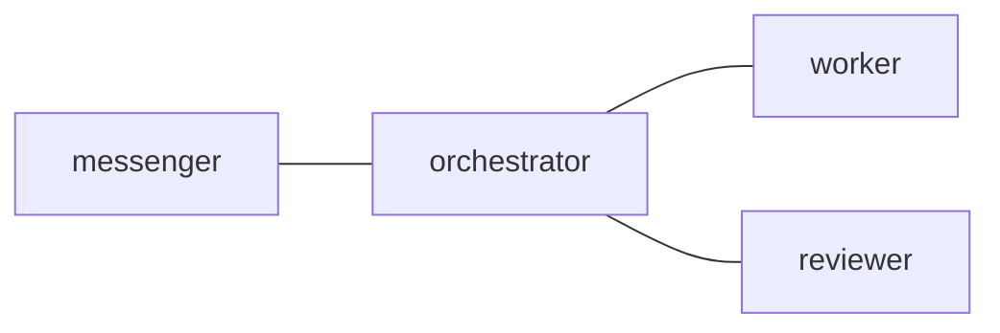

## 1. The Large Window Is Not an Operating System

The useful fact in my current Claude Code setup is not that Sonnet has the largest visible window. It is that Sonnet is the default model.

On 2026-06-02, my Claude Code `/model` menu labels Sonnet 4.6 as "Default (recommended)" and "Best for everyday tasks." The same menu labels Opus 4.8 as "Opus (1M context)" and "Most capable for complex work." That is the model-choice motivation for this article: sustained agent workflows need to run well on the everyday Sonnet path, while Opus remains the higher-capability, high-context option to reach for deliberately.

The usage motivation is more concrete. On the same day, my Claude Code `/usage` view on Claude Team showed a current-session meter, a current-week all-models meter, and an approximate local contributor view. It also said the last-24-hour contributors are independent characteristics rather than a breakdown. The strongest signals were operational: 98% usage from subagent-heavy sessions, 42% usage at more than 150K context, and 14% usage from subagents under `subagent-review`.

I should treat those bars as local evidence, not as a universal map of Claude Code accounting. A May 2026 Max 20x screenshot I saw claimed a separate "Current week (Sonnet only)" bar and usage-credit spend, while my current Team screen did not show that Sonnet-only bar. That does not prove the bucket disappeared everywhere.

The official picture is more conditional. The Claude Code [changelog](https://code.claude.com/docs/en/changelog) says version 2.1.89 hid a redundant "Current week (Sonnet only)" bar for Pro and Enterprise plans, and version 2.1.159 had no user-facing changes. The current [Max plan page](https://support.claude.com/en/articles/11049741-what-is-the-max-plan) says Max plans have both an all-model weekly limit and a Sonnet-only weekly limit. The current [Team plan page](https://support.claude.com/en/articles/9266767-what-is-the-team-plan) says Team Standard seats have an all-model weekly limit, while Team Premium seats have both all-model and Sonnet-only weekly limits. So the safe conclusion is that `/usage` surfaces can vary by plan, seat, version, and usage-credit state.

That changes the argument. The trap is not only "Opus versus Sonnet." The trap is treating a default model, a large context window, or a swarm of subagents as a workflow.

The [Claude Code model guide](https://support.claude.com/en/articles/14552983-models-usage-and-limits-in-claude-code) says `/model` is the source of truth for the models available to your account. It describes Sonnet as the default for most coding work. It frames Opus as the deeper-reasoning choice for harder refactors, difficult debugging, and architecture decisions, and it names "plan with Opus, execute with Sonnet" as a normal way to spend Opus where it pays off.

Anthropic's [context window documentation](https://platform.claude.com/docs/en/build-with-claude/context-windows) makes the operating warning clear: more context is not automatically better, and recall can degrade as token count grows. Current Claude docs also show why "Sonnet context" is not one fixed number. The [paid-plan context page](https://support.claude.com/en/articles/8606394-how-large-is-the-context-window-on-paid-claude-plans) currently describes Claude Code 1M paths for recent Opus models and Sonnet 4.6, with plan and usage-credit conditions. The [API context page](https://support.claude.com/en/articles/8606395-how-large-is-the-claude-api-s-context-window) similarly separates 1M-capable recent Opus and Sonnet 4.6 deployments from 200K-class models. The exact limit depends on the model, product surface, account, and deployment, but the operating problem does not go away when the window gets larger.

The stronger motivation is usage, not just length. Current Claude Help Center pages separate [usage limits from length limits](https://support.claude.com/en/articles/11647753-how-do-usage-and-length-limits-work): usage limits are the plan budget over time, while length limits are the context window for a single conversation. Usage is affected by the model, conversation length, attached files, and tools; it is also shared across `claude.ai`, Claude Desktop, and Claude Code.

For Claude Code specifically, the model guide explains why the `/usage` view points at context shape. Every turn sends the conversation so far, project context, and the new prompt. Long sessions keep carrying old messages, files, tool output, and diffs forward. That is why `/clear` between tasks and `/compact` mid-task are not cosmetic commands; they are usage controls.

Opus still matters. It is the 1M-context complex-work option in my `/model` menu, and the Claude Code guide says it uses meaningfully more quota. But I should not describe Claude Code usage accounting as simply "Opus versus everything else" when the visible `/usage` screen is showing current-session pressure, current-week all-model pressure, high-context usage, and subagent-heavy usage.

In practical terms, Sonnet is where most sustained work has to become efficient. The everyday/default model still needs to handle tasks that are too large for casual chat but should not spend Opus turns on every step. Examples include a repository plus logs, a design document plus implementation files, a long debugging transcript, or a review packet with enough source context to reason safely. Native subagents can help isolate noisy work, and Claude Code's [subagent docs](https://code.claude.com/docs/en/sub-agents) let a subagent choose or inherit a model. But the current `/usage` evidence makes the tradeoff visible: unbounded subagent fan-out and 150K-plus contexts are themselves usage pressure.

For agentic coding, the failure mode is rarely "the model cannot fit the file." The failure mode is usually operational:

- The task owner is no longer obvious
- The current checklist is buried under old turns
- A reviewer request never gets answered
- Compaction summarizes away the detail that made the next step safe
- One agent becomes planner, implementer, reviewer, memory keeper, and user-facing reporter

That is why I do not try to solve long-running Claude work by stuffing more text into Claude. I treat context as a cache. The durable parts of the workflow need a different home.

## 2. Practice One: Split the Work Across Agents

The first practice is to make each context window smaller on purpose.

A single capable agent can plan, edit, test, review, and report, but that role stack gets heavy. The session becomes full of stale options, partial checks, reviewer notes, user-facing phrasing, and implementation details. A large context window makes that possible for longer. It does not make it clean.

I prefer to split the work by responsibility:

| Responsibility       | Narrower context shape            |
| -------------------- | --------------------------------- |
| receive user request | messenger or entry role           |
| plan and delegate    | orchestrator role                 |
| implement            | worker role                       |
| verify               | reviewer role                     |
| summarize to user    | messenger or orchestrator handoff |

This is not about pretending multiple agents are magically objective. A reviewer can still miss things. An orchestrator can still delegate poorly. The practical advantage is narrower working memory: each agent receives the context needed for its role and is less likely to carry irrelevant turns forward.

The large window is still valuable here. It becomes room for a focused role to inspect files, logs, and evidence deeply, not an invitation to keep the entire organization inside one prompt.

## 3. Practice Two: Reground the Role After Compaction

Automatic compaction is useful because it keeps long sessions alive. It is also risky because it changes what the agent has immediately available.

The dangerous version is silent compaction:

1. The agent is midway through a task.
2. The runtime compacts the conversation.
3. The agent continues from a summary.
4. A small but important instruction no longer has the same force.

After compaction, I want the agent to ground itself again before acting:

- What role am I in?
- Who can I talk to?
- What task is currently open?
- What original checklist defines "done"?
- What evidence already exists outside the transcript?

That reminder should not depend on the compressed chat being perfect. Compaction is exactly the moment when the session should read durable instructions again, recover the task artifact, and continue from explicit state.

If Claude Code exposes an after-compaction hook in your version, that hook is an obvious place to re-input the role after compaction. For a single agent, the hook could say: you are the implementer, read this instruction file, recover this task artifact, and continue from the current checklist.

The multi-agent case is harder. The same reminder cannot be injected into every pane. A messenger, orchestrator, worker, and reviewer each need a different role, a different contact list, and a different set of safety rules. The hook needs a stable way to answer "which agent just compacted?"

In a tmux-based setup, the practical answer is the pane title. A pane titled `worker` should recover the worker role. A pane titled `orchestrator` should recover the coordinator role. A pane titled `messenger` should stay transport-only. The pane title is outside the model context, visible to the harness, and simple enough to use as local role identity.

## 4. Practice Three: Externalize the Task List

Long context helps reasoning. It is bad at being a task database.

A single long chat mixes different kinds of information:

| In the same context window | What the agent needs instead             |
| -------------------------- | ---------------------------------------- |
| old decisions              | current decisions with evidence          |
| abandoned plans            | active checklist and owner               |
| command output             | verification summary and failing checks  |
| review comments            | open and resolved findings               |
| side discussion            | routable handoff to the responsible role |

The difference matters because the model does not experience its own context as a structured queue. It sees a sequence. The operator sees a long transcript. Neither of those is the same as "worker has one open task, reviewer owes one approval, messenger should not implement, and compaction just happened."

The fix is not to make every prompt longer. The fix is to create small durable surfaces outside the prompt:

- Messages for handoffs
- Reply-required slots for obligations
- Task artifacts for checklists and evidence
- Role boundaries for decomposition
- Recovery events for compaction

This gives the model a current working set instead of asking it to infer the live task board from thousands of old tokens.

## 5. The Concrete Tool: `tmux-a2a-postman`

Everything up to this point is tool agnostic. The operating model is: split the work across agents, restore the right role after compaction, and keep task state outside the transcript.

My concrete local tool for that model is [`tmux-a2a-postman`](https://github.com/i9wa4/tmux-a2a-postman).

I introduced the mailbox layer in [a previous `tmux-a2a-postman` post](2026-05-17-tmux-a2a-postman-markdown-mail-for-ai-agent-teams.qmd). This post is about the context-management angle: using `tmux-a2a-postman` as the coordination layer around Claude's large but fallible working memory.

`tmux-a2a-postman` does not make Claude smarter. It does not increase the context window. It does not replace Claude Code, Codex CLI, tmux, or native subagents.

It adds a coordination surface:

- Roles are named in `postman.md`
- Allowed handoffs are defined as Mermaid edges
- Node identity uses tmux pane titles
- Messages are stored as Markdown mail
- Recipients claim mail with `pop`
- Required replies open exact input requests
- Status reports `pending`, `waiting`, `ready`, `stale`, queues, and dead letters
- Archived mail remains readable after the pane history is gone

The key sentence is this:

> Context is for reasoning; `tmux-a2a-postman` mail is for obligations.

That lets a Claude session use its available tokens for the current piece of work instead of carrying the whole project's workflow state in a chat transcript.

## 6. Multi-Agent Decomposition in Practice

The simplest useful topology is still small:

```{mermaid}
#| label: fig-postman-context-route
graph LR
    messenger["messenger<br/>human-facing"]
    orchestrator["orchestrator<br/>task coordinator"]
    worker["worker<br/>implementation"]
    reviewer["reviewer<br/>verification"]

    messenger --- orchestrator
    orchestrator --- worker
    orchestrator --- reviewer

    class messenger entry
    class orchestrator,worker,reviewer role
    classDef entry fill:#dbeafe,stroke:#2563eb,color:#0f172a
    classDef role fill:#f8fafc,stroke:#64748b,color:#0f172a
```

One user request can become a smaller route:

```{.text}
messenger -> orchestrator: user request and constraints
orchestrator -> worker: scoped implementation request
worker -> orchestrator: DONE or BLOCKED with evidence
orchestrator -> reviewer: verify the result
reviewer -> orchestrator: APPROVED or NOT APPROVED
orchestrator -> messenger: final user-facing result
```

Each role sees a narrower job. The worker does not need to remember how to talk to the human. The reviewer does not need the full implementation transcript. The messenger does not need to inspect files. The orchestrator holds the route, not every implementation detail.

This reduces the effective task size. Instead of one Claude context carrying every responsibility, each pane receives a smaller message with the context needed for that role.

## 7. Compaction Becomes a Mail Event

`tmux-a2a-postman` treats compaction as something the harness can notice. The daemon can scan pane output for newer Claude or Codex compaction markers. When it sees one, it sends a compaction-triggered daemon PING to that node.

That automatic compaction PING is not a task by itself. It is a continuity signal:

- Claim the mail
- Read the archived body
- Read the relevant role contract and contact hints again
- Recover the local skill catalog if configured
- Continue from durable task state instead of pane memory alone

This is where tmux pane titles become more than a naming convention. `tmux-a2a-postman` already treats a node as an agent role identified by its pane title. If the `worker` pane compacts, it can receive worker-specific recovery context. If the `orchestrator` pane compacts, it can receive coordinator-specific recovery context. The hook or daemon does not have to infer the role from a compressed conversation.

The configuration surface is intentionally small. A `skill_path` catalog can opt into ordinary PING mail, compaction PING mail, or both:

````{.markdown filename="postman.md"}
---
skill_path:
  - path: ~/.codex/skills
    inject:
      - ping
      - compaction_ping
    skills:
      - postman-session-operator
      - postman-send-message
      - postman-config-auditor
---

## `edges`


````

The important point is not the PING text. The important point is that compaction creates a mailbox event. The agent gets a reason to ground itself again in durable instructions after the runtime changed its working memory.

That is how I want to use a large window: aggressively, but with recovery hooks when the window is rewritten.

## 8. If You Do Not Use `tmux-a2a-postman`

You can build a lighter version without `tmux-a2a-postman`.

For example, an after-compaction hook could read the current tmux pane title, map it to a role prompt, and paste or submit the matching reminder into that pane. A shell script could map `worker` to `roles/worker.md`, `reviewer` to `roles/reviewer.md`, and so on. A shared Markdown file, issue, or task board could hold the durable checklist.

That is a reasonable design if you only need role recovery.

The harder part is communication. Once there are multiple agents, they need a way to send work to each other, know whether a reply is required, recover missed messages, and see which obligations are still open. Without a coordination tool, you still have to answer the operational question: how do the agents talk to each other in the first place?

`tmux-a2a-postman` is my answer to that missing layer. It does not just re-inject role text. It gives the pane-title roles a local mail route, an archive, reply-required slots, and session status.

## 9. Task Management Belongs Outside the Transcript

The next failure mode is work getting forgotten.

A long Claude session can contain a perfect checklist and still lose track of it after enough turns. The checklist is present, but it is not an active obligation. It is just text somewhere in the past.

`tmux-a2a-postman` separates transport obligations from task evidence.

When a sender uses `--reply-required`, the message opens an `input_request_id`. Status can then show:

- `pending`: This node has inbound required work
- `waiting`: This node is waiting for another node's required reply
- `input_required_count`: Inbound required replies still open
- `waiting_on_input_count`: Outbound required replies still open

Reading a message with `pop` clears unread mail. It does not clear the required work. The required work closes only when the receiver sends a resolving reply with the matching input request.

```{.bash}
tmux-a2a-postman send-heredoc \
  --to orchestrator \
  --reply-to <message-id> \
  --fills-input-request-id <input-request-id> <<'MESSAGE_BODY'
DONE: Requirements satisfied.
Task artifact: <artifact-reference>
Original checklist: PASS
Evidence: <commands, checks, changed files, or review links>
Remaining blockers: none
MESSAGE_BODY
```

That still does not prove the task is correct. It only closes the transport slot.

For the actual task, I use a durable Markdown artifact. In my setup that usually means [`mkmd`](2026-03-22-mkmd-mktemp-wrapper-for-ai-agents.qmd): one file with the original checklist, progress log, decisions, surprises, verification, blockers, and completion verdict.

The pairing is useful:

| Layer                   | Responsibility                                      |
| ----------------------- | --------------------------------------------------- |
| context window          | Reason about the current step                       |
| `tmux-a2a-postman` mail | Deliver the request and keep reply obligations open |
| task artifact           | Preserve checklist, decisions, and evidence         |
| reviewer route          | Verify the artifact and changed files               |

This is why I do not want the agent to "remember the to-do list." I want it to read the current task artifact.

## 10. Why This Uses the Large Window Better

The most practical way to use a large context window is sometimes to stop using one enormous context.

With the practices above, the large window becomes a high-quality local workspace:

- The worker can keep implementation files, logs, and acceptance criteria in view.
- The reviewer can keep the diff, rendered output, and verification evidence in view.
- The orchestrator can keep route state and open requests in view.
- The messenger can stay clean and user-facing.

It also helps with context rot because durable state lives outside the compressed chat:

- The mail item that assigned the work
- The reply-required slot that remains open
- The task artifact that preserves the checklist
- The archived message body that can be read again
- The review route that can request another pass

The context window becomes a working area, not the whole workshop.

## 11. A Minimal Operating Pattern

For a real task, the loop looks like this.

The orchestrator sends a scoped request:

```{.bash}
tmux-a2a-postman send-heredoc --to worker --reply-required <<'MESSAGE_BODY'
Task: write or update the article.

Original checklist:
- [ ] Article exists under en/blog.
- [ ] It explains why context alone is insufficient.
- [ ] It covers compaction recovery, task management, and decomposition.

Reply with DONE or BLOCKED and include evidence.
MESSAGE_BODY
```

The worker claims the request:

```{.bash}
tmux-a2a-postman pop
```

The important behavior is that `pop` returns an archived Markdown path. The agent must read that body before acting. Pane history is not the source of truth.

The worker creates or updates the durable task artifact, performs the work, verifies it, and closes the required input:

```{.bash}
tmux-a2a-postman send-heredoc \
  --to orchestrator \
  --fills-input-request-id <input-request-id> \
  --reply-to <message-id> <<'MESSAGE_BODY'
DONE: Article written and verified.
Task artifact: <artifact-reference>
Original checklist: PASS
Evidence:
- changed file: en/blog/example.qmd
- checks: rumdl, Vale, Harper, Quarto render
Remaining blockers: none
MESSAGE_BODY
```

The DONE report is intentionally boring. That is the point. It gives the orchestrator a compact status object instead of another long transcript to interpret.

## 12. The Rule of Thumb

My rule for large Claude Sonnet context windows is simple:

> Put reasoning in context. Put obligations in mail. Put evidence in artifacts.

The context window is a powerful workspace. It is not a reliable memory system, queue, review process, or project manager.

For long agent runs, I want three things around it:

1. Multi-agent decomposition so each role has a smaller job.
2. Automatic compaction PING recovery so the agent restores role and state after the runtime rewrites the conversation.
3. Durable task management so the checklist and evidence survive outside the model's working memory.

`tmux-a2a-postman` is just the local implementation of that operating model. It keeps the chat focused on reasoning and moves the workflow into explicit, readable files.
