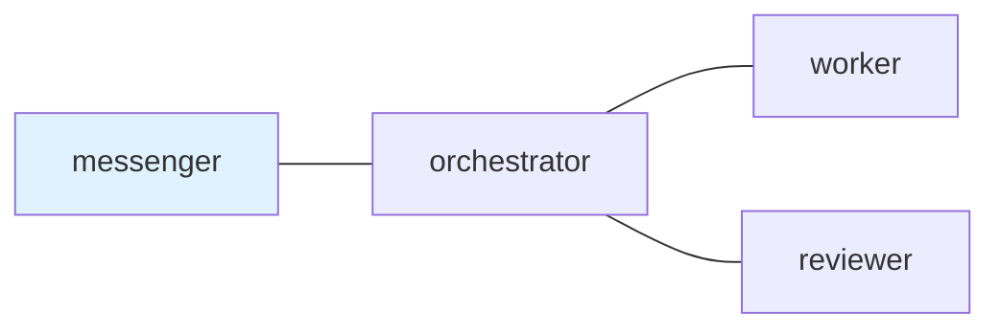

## 1. The Graph I Actually Needed

"Graph engineering" is starting to become a useful phrase for multi-agent
systems. The term is still young, but the direction is easy to recognize:
instead of treating agents as one long chat, name the actors, name the edges,
and make the handoffs visible.

That vocabulary can get too big too quickly. A graph can mean a workflow
runtime, a service protocol, a planner, a message queue, a review system, or
just a diagram. I do not want to blur those together.

The graph I needed was smaller.

I wanted a local map of terminal agents:

- who is the human-facing role;
- who coordinates work;
- who implements;
- who reviews;
- who may talk to whom;
- which request still needs a reply.

That is the shape `tmux-a2a-postman` gives me. It is not a LangGraph or AutoGen
replacement. It is not an A2A protocol implementation. It is a local
conversation topology for tmux panes, written in Markdown.

Repository: <https://github.com/i9wa4/tmux-a2a-postman>

## 2. Execution Graphs and Conversation Topologies

The distinction matters.

[LangGraph's Graph API](https://docs.langchain.com/oss/python/langgraph/graph-api)
models agent workflows with state, nodes, and edges. Nodes run logic and return
state updates. Edges decide what node runs next. The graph is an execution
structure.

[AutoGen GraphFlow](https://microsoft.github.io/autogen/stable/user-guide/agentchat-user-guide/graph-flow.html)
also describes a directed graph where agents are nodes and edges define allowed
execution paths. It supports sequential, parallel, conditional, and looping
flows.

[Google ADK workflows](https://adk.dev/workflows/) describe multi-agent,
multi-node applications for more predictable and reliable systems, and its
[A2A documentation](https://adk.dev/a2a/intro/) is about agents communicating
across services, teams, languages, or frameworks.

Those are stronger and broader surfaces than postman.

`tmux-a2a-postman` does not execute nodes in a graph runtime. The nodes are
already-running tmux panes. The edges are allowed conversation paths. The
messages are Markdown mail. The daemon tracks delivery, unread/read state,
reply-required obligations, and status.

That makes the right comparison narrower: postman is an org graph or
conversation topology for a local terminal agent team.

## 3. The Small Topology

The minimal useful version is not impressive as a diagram. That is the point.

```{mermaid}
graph LR
    messenger["messenger<br/>human-facing"]
    orchestrator["orchestrator<br/>coordinator"]
    worker["worker<br/>implementation"]
    reviewer["reviewer<br/>verification"]

    messenger --- orchestrator
    orchestrator --- worker
    orchestrator --- reviewer

    class messenger entry
    class orchestrator,worker,reviewer role
    classDef entry fill:#dbeafe,stroke:#2563eb,color:#0f172a
    classDef role fill:#f8fafc,stroke:#64748b,color:#0f172a
```

In `postman.md`, the same idea is ordinary Markdown:

````{.markdown filename="postman.md"}
## `edges`



## `messenger`

### `role`

Human-facing transport role. Relay work to orchestrator.

## `orchestrator`

### `role`

Coordinator. Delegate implementation to worker and request review from reviewer.

## `worker`

### `role`

Implementation role. Return changed files, checks, evidence, and blockers.

## `reviewer`

### `role`

Verification role. Check the result and return an evidence-backed verdict.
````

The important part is not the styling. The node names correspond to pane titles
and role contracts. The `---` edges define who can send mail to whom. The
`ui_node` class marks the first human-facing role.

That is enough structure to stop relying on pane memory.

## 4. Why a Mailbox Belongs in the Graph

A graph of roles is only useful if work can move through it without vanishing.

Terminal agents already have the execution surface: shells, editors, test
commands, repository files, and long-lived tmux panes. What disappears is the
handoff. A request sits in one chat history. A reviewer answers in another
pane. A human later asks what is still open, and everyone scrolls.

Postman turns the handoff into local state.

A message has a sender and receiver. A receiver claims it with `pop`. Some
messages are fire-and-forget. Others are reply-required and open an exact input
request. A completion reply names evidence, the task artifact, the original
checklist status, and remaining blockers.

That is a small idea, but it changes the operating model. The graph is no
longer just "orchestrator can talk to worker." It is "orchestrator sent this
specific request to worker, worker claimed it, and this exact reply slot is
still open."

The graph becomes a coordination map with memory.

## 5. Where This Fits in the Current Discussion

The current agent discussion is moving upward from prompts toward loops,
workflows, and organizations.

The Japanese article
[「Loop EngineeringはGraph Engineeringの中にある」](https://aimanavo.com/c/morphox_ai/a/MAfrDjpPkKGUFw)
uses "Graph Engineering" to talk about wiring agents as an organization. A
[TrueFoundry article on graph engineering](https://www.truefoundry.com/blog/graph-engineering-enterprise-guide)
similarly treats topology, routers, joins, tools, human checkpoints, governance,
and observability as part of the engineering problem.

I read those as trend signals, not specifications. The settled references are
still the framework docs: LangGraph, AutoGen, and ADK all show that nodes,
edges, routing, fan-out, and multi-agent workflow vocabulary are now ordinary
parts of the agent engineering conversation.

Postman fits the org-graph side of that discussion. It does not provide a
planner that decides the next node. It does not run a state graph. It does not
standardize remote service-to-service agent communication. It does make the
local organization legible:

- stable roles;
- declared handoff edges;
- a human-facing entry node;
- Markdown role contracts;
- durable mail;
- explicit reply obligations;
- status that a human or another agent can inspect.

That is the terminal-sized version of the idea.

## 6. The Useful Constraint

The most useful constraint is that the graph stays boring.

An agent org graph should not start with twenty roles. Mine usually starts with
four:

- `messenger` talks to the human;
- `orchestrator` shapes and routes the task;
- `worker` changes files or investigates;
- `reviewer` checks evidence.

More roles can appear later: approver, critic, operator, release coordinator.
But the small graph is already enough to separate responsibilities that do not
belong in one context window.

The worker does not need to know how to talk to the human. The reviewer does
not need the worker's whole private reasoning. The messenger does not need to
inspect the repository. The orchestrator does not need to perform every edit.

The edge list is a pressure valve for context.

## 7. The Honest Boundary

There is a safety boundary here too.

Postman is coordination, not enforcement. A declared edge does not sandbox a
process. A command approval thread is not an OS permission model. A Markdown
role contract is not a proof that an agent will behave.

That limitation is not a footnote. It is what keeps the comparison honest.

Use runtime sandboxing, permissions, hooks, CI, branch protection, and human
approval where those are the right tools. Use postman for the thing it is good
at: making local agent handoffs explicit, inspectable, and durable enough to
survive one model context.

The value is not that a Markdown graph replaces an execution framework. The
value is that a Markdown graph makes the local organization visible before you
need a heavier one.

## 8. Why This Is Worth Showing

The screenshot-friendly README change that prompted this article puts the
rendered topology next to the Mermaid source. That pairing is small, but it
captures the product idea well.

The diagram says: here is the organization.

The source says: here is the contract you can edit.

The mailbox says: here is what happened.

That is the smallest useful agent org graph I have found so far. It fits in
tmux because the first problem is not executing a distributed graph. The first
problem is knowing who owns the next message.

## Sources

- [`tmux-a2a-postman`](https://github.com/i9wa4/tmux-a2a-postman)
- [LangGraph Graph API](https://docs.langchain.com/oss/python/langgraph/graph-api)
- [LangGraph workflows and agents](https://docs.langchain.com/oss/python/langgraph/workflows-agents)
- [AutoGen GraphFlow](https://microsoft.github.io/autogen/stable/user-guide/agentchat-user-guide/graph-flow.html)
- [Google ADK workflows](https://adk.dev/workflows/)
- [Google ADK A2A introduction](https://adk.dev/a2a/intro/)
- [Loop EngineeringはGraph Engineeringの中にある](https://aimanavo.com/c/morphox_ai/a/MAfrDjpPkKGUFw)
- [TrueFoundry: Graph Engineering for Multi-Agent Systems](https://www.truefoundry.com/blog/graph-engineering-enterprise-guide)
