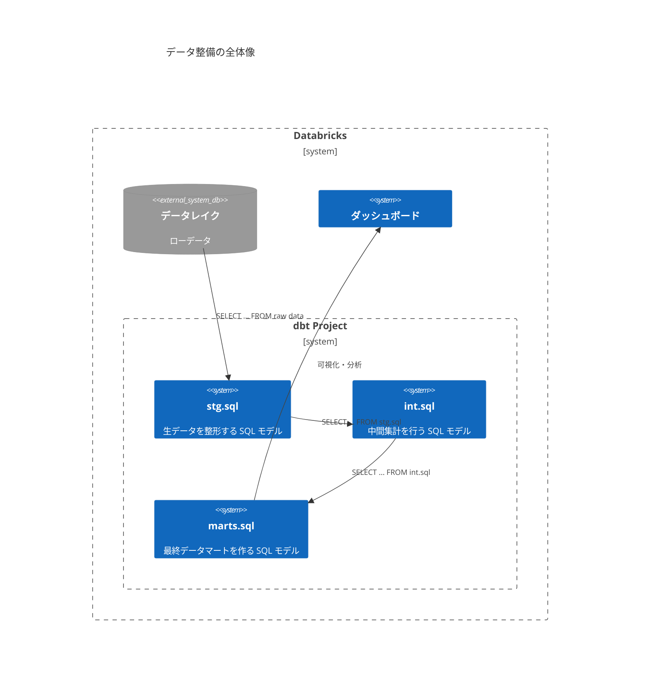

# Cursorのおすすめ設定 & Cursorにデータ分析を任せる方法
馬渡 大樹
2025-05-22

<meta name="Hatena::Bookmark" content="nocomment" />

<script>
// Quartoが読み込むAnchorJSのデフォルトオプションを上書き
// window.quartoConfig が存在する場合はそこから設定を変更
window.addEventListener('load', function() {
  if (window.anchors) {
    // すでに初期化されている場合は設定を変更して再適用
    window.anchors.options.icon = '#';
    window.anchors.remove('.anchored');
    window.anchors.add('.anchored');
  }
});
</script>

## 1. はじめに

### 1.1. 自己紹介

<div class="columns">

<div class="column" width="50%">

|        |                                           |
|--------|-------------------------------------------|
| 名前   | 馬渡 大樹 (Mawatari Daiki)                |
| 所属   | 株式会社GENDA - IT戦略部                  |
| 職種   | データエンジニア / 機械学習基盤エンジニア |
| GitHub | [@i9wa4](https://github.com/i9wa4)        |

- 好き
  - ゲームセンター
  - Vim
  - Happy Hacking Keyboard
- 好きではない
  - Zero Configuration

</div>

<div class="column" width="50%">


</div>

</div>

### 1.2. 私の主なデータ系業務紹介

<div class="columns">

<div class="column" width="30%">

Cursor の用途を説明するために簡単に業務を紹介します

まとめると **SQL を書くことが多い** です

**業務1**

- DWH のデータ整備
- dbt (data build tool) により集計テーブルを SQL ファイルとして管理する
  - SQL ファイル主体のプロジェクトがあるという認識で OK

**業務2**

- データ可視化用ダッシュボード作成
- データ分析サポート

**業務3**

- データ基盤の改修

</div>

<div class="column" width="70%">



</div>

</div>

## 2. Cursor のおすすめ設定

### 2.1. Cursor 設定との向き合い方

<div class="columns">

<div class="column" width="50%">

**Cursor のテキストエディタとしての設定をしっかりやるべきか？**

私は **No** だと思う

- AI エージェントはプロジェクト設定を守ってくれるとは限らない
- 多様性のある Pull Request を許容できるように CI を整備したほうがよい

------------------------------------------------------------------------

**Cursor の用途の割り切り**

AI
エージェント実行アプリとして使いやすくなるグローバル設定を紹介していきます

</div>

<div class="column" width="50%">


Sad News😢

[Microsoft が Cursor を含む VSCode フォークで C/C++ 拡張機能をブロック -
BigGo
ニュース](https://biggo.jp/news/202504050723_Microsoft_Blocks_CPP_Extension_VSCode_Forks)

</div>

</div>

### 2.2. settings.json に反映される設定 (1)

F1 \> Preferences: Open Settings

VS Code に存在する左端のバーを表示させる

> The vertical orientation is no longer maintained.

使いやすくなりますが自己責任で


### 2.3. settings.json に反映される設定 (2)

<div class="columns">

<div class="column" width="55%">

F1 \> Preferences: Open Settings

チャットメッセージのサイズを大きくする

チャット欄が Cursor の本体なのでデカくしましょう


</div>

<div class="column" width="45%">

文字を大きくする決意をさせてくれたポスト

ポストの内容通り右上歯車からも設定できる


<https://x.com/tetsuro_b/status/1922679755863970196>

</div>

</div>

### 2.4. 右上歯車アイコンから行う設定

<div class="columns">

<div class="column" width="50%">

見ておくべき項目

- General
  - Privacy mode: **Enabled**
    - ポリシーで設定変更禁止になっていれば安心
- Features
  - Include project structure \[BETA\]: **ON**
    - 効果は実感できていないが ON
  - Enable auto-run mode: **ON** ⚠️ 要注意
    - MCP tools protection: **OFF** ⚠️ 要注意

auto-run mode
は自分の用途や権限に合った範囲内で最大限許容すると効率アップ！

</div>

<div class="column" width="50%">


</div>

</div>

### 2.5. 外部設定

<div class="columns">

<div class="column" width="50%">

**グローバルな gitignore 設定**

リポジトリ内に自分と Cursor の作業用ディレクトリを作成する

<div class="code-with-filename">

**~/.config/git/ignore**

``` gitignore
.i9wa4/
```

</div>

`~/.gitignore_global` ではなくデフォルト設定に従ったほうが Git
と仲良くなれる

[まだ .gitconfig に core.excludesfile を設定しているの？ \#Git -
Qiita](https://qiita.com/ueokande/items/e0409219e7c68e4277b9)

</div>

<div class="column" width="50%">


ポスト内容と用途が違うが Cursor
に文脈を与えたりアウトプットさせるのに便利であった

<https://x.com/mizchi/status/1914543131888066561>

</div>

</div>

### 2.6. MCP 設定 (基本編)

<div class="columns">

<div class="column" width="60%">

DWH 向けの MCP Server を利用しクエリを実行できるようにする

------------------------------------------------------------------------

参考

<https://github.com/RafaelCartenet/mcp-databricks-server>

<div class="code-with-filename">

**mcp.json**

``` json
{
    "mcpServers": {
        "databricks": {
            "command": "uv",
            "args": [
                "--directory",
                "~/ghq/github.com/RafaelCartenet/mcp-databricks-server",
                "run",
                "main.py"
            ]
        }
    }
}
```

</div>

</div>

<div class="column" width="40%">

実行の様子


</div>

</div>

### 2.7. MCP 設定 (非公式 MCP サーバーとの向き合い方)

前頁で Databricks MCP Server を紹介しましたが非公式 MCP Server です

**非公式 MCP サーバーとの向き合い方**

1.  実装を理解した上でコミットハッシュ指定して使う
    - コード量は少なめだし DeepWiki を使えば壁打ちもできる
2.  自分で作る
    - 私は Fork して機能追加してます
      - [Databricks MCP Server を Service Principal
        認証対応させた](https://zenn.dev/genda_jp/articles/2025-04-29-mcp-databricks-server-service-principal)

**心得**

- 自分の手足の延長となるツールなので自分で可否判断できるものだけ使いましょう
- 無批判に何でも使うと最終的には不自由な世界になります

### 2.8. MCP 設定 (認証情報隠蔽)

⚠️ 未検証の内容です

プロジェクト共通設定として `.cursor/mcp.json` を置きたい場合に備えて MCP
設定から認証情報を隠蔽するために **envmcp** が利用できます

<https://github.com/griffithsbs/envmcp>

<div class="columns">

<div class="column" width="50%">

**Before**

``` json
{
  "my_database": {
    "command": "start-my-mcp-server",
    "args": [
      "my secret connection string",
    ]
  },
  "my_other_mcp_server": {
    "command": "start-my-other-mcp-server",
    "env": {
      "MY_API_KEY": "my api key"
    }
  }
}
```

</div>

<div class="column" width="50%">

**After**

``` json
{
  "my_database": {
    "command": "npx",
    "args": [
      "envmcp",
      "start-my-mcp-server",
      "$MY_DATABASE_CONNECTION_STRING",
    ]
  },
  "my_other_mcp_server": {
    "command": "npx",
    "args": [
      "envmcp",
      "start-my-other-mcp-server",
    ]
  }
}
```

</div>

</div>

### 2.9. ルール設定

⚠️ いずれも未検証の内容です

<div class="columns">

<div class="column" width="50%">

プロジェクトに対してルールを設定できると便利

    project/
      .cursor/rules/        # Project-wide rules
      backend/
        server/
          .cursor/rules/    # Backend-specific rules
      frontend/
        .cursor/rules/      # Frontend-specific rules

<https://docs.cursor.com/context/rules>

Devin 向けにも別途ルールを整備する必要があり躊躇していました😢

</div>

<div class="column" width="50%">

シンボリックリンクを張ればよいという発想

> - Unified `.ai/` folder for all your project-wide AI rules (Markdown)
> - Auto-generate:
>   - `.cursor/rules/*.mdc`
>   - `.cline-rules`
>   - `.github/copilot-instructions.md`
>   - `devin-guidelines.md`
> - Symlink or copy mode (auto-detects OS capability)

<https://github.com/airulefy/Airulefy>

</div>

</div>

## 3. まとめ

### 3.1. Cursor の設定まとめとデータ分析向け構築

以下の整備をすることで Cursor
が自律的に爆速でデータ分析を行えるようになります

今後はルール設定を調整していきたいです！

<div class="columns">

<div class="column" width="70%">

|              |                                            |
|-------------:|:-------------------------------------------|
|  Cursor 設定 | auto-run mode を利用する                   |
|          MCP | DWH の MCP Server を利用する               |
| プロジェクト | dbt プロジェクトを作業場とする             |
|   その他設定 | gitignore で個人作業ディレクトリを用意する |

</div>

<div class="column" width="30%">

</div>

</div>
