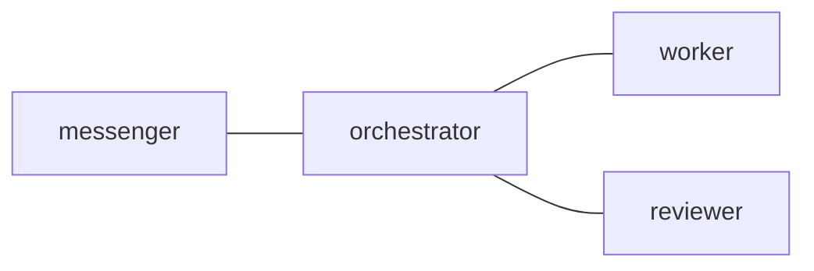

## 1. はじめに

Claude Code や Codex CLI のような CLI エージェントを tmux 上で複数動かすと、実装役、レビュー役、調整役を分けやすくなります。

ただし、ペインを並べるだけでは足りない場面が出てきます。

どのエージェントに何を渡したのか、どの依頼に返信が必要なのか、レビュー済みなのか、後から見て分かる形で残っているのか。

このあたりをターミナルのスクロールバックや長いチャット履歴だけに任せると、だんだん不安になります。

そこで作っているのが `tmux-a2a-postman` です。

@[card](https://github.com/i9wa4/tmux-a2a-postman)

一言でいうと、tmux 上の AI エージェントに Markdown の郵便受けを足すためのローカルツールです。

## 2. 欲しかったのは協調の面

tmux は作業場として優秀です。

セッション、ウインドウ、ペインを長く生かせます。ペインタイトルを付けられます。外部から入力を送れます。capture もできます。

以前の記事では、AI エージェント時代の作業場として tmux を使う話を書きました。

@[card](https://zenn.dev/i9wa4/articles/2026-02-08-tmux-intro-ai-agent-orchestration)

一方で、tmux 自体はエージェント間の依頼や返信待ちを管理する道具ではありません。

欲しかったのは次のような層です。

- 誰が誰に話してよいか
- どの依頼がどの役割に届いたか
- 受信側がその依頼を読んだか
- 返信が必要な依頼がまだ開いているか
- DONE や BLOCKED にどんな証拠を添えるべきか
- レビュー役や承認役へどう渡すか

`tmux-a2a-postman` は、この協調の面を tmux の上に薄く足します。

## 3. Markdown の手紙として渡す

postman の基本は単純です。

送信側は Markdown の手紙を相手の inbox に置きます。受信側は `pop` でそれを claim して、read archive に移してから読みます。

返事が必要な依頼には `input_request_id` が付きます。返信側はその ID を閉じる形で `DONE` か `BLOCKED` を返します。

実際の操作は shell から行います。

```sh
tmux-a2a-postman send-heredoc --to worker <<'POSTMAN_BODY'
記事を読み、曖昧な表現を直し、検証結果を添えて返してください。
POSTMAN_BODY
```

quoted heredoc を使うのは、本文にコードフェンス、バッククォート、`$HOME`、`$(...)` のような文字列が入っても shell に壊されないようにするためです。

エージェントへの依頼文は長くなりがちなので、ここは地味に重要です。

## 4. ターミナルの会話をローカル状態にする

postman を入れる前は、エージェントに何かを頼んだ事実がチャット履歴やペインの表示に埋もれます。

postman を入れると、依頼は Markdown mail として残ります。

| 観点         | ペインだけの場合             | postman を使う場合               |
| ------------ | ---------------------------- | -------------------------------- |
| 依頼         | チャットや scrollback に残る | Markdown mail として配送される   |
| 未読         | 見たかどうかが曖昧           | inbox と read archive で分かる   |
| 返信待ち     | 人間が覚えておく             | input request として見える       |
| 役割         | ペイン名や運用ルール頼み     | Markdown の role contract に置く |
| 後からの確認 | ターミナル履歴を探す         | archive と artifact を確認する   |

ここで大事なのは、postman がエージェントを賢くするわけではないことです。

やっているのは、依頼、未読、既読、返信待ち、証拠の置き場をローカル状態として見えるようにすることです。

## 5. postman.md を制御面にする

中心に置くのは `postman.md` です。

これは人間にもエージェントにも読める Markdown ファイルです。

中には、通信できる role の topology、共通ルール、role ごとの責務、参照すべき Agent Skills などを書きます。

たとえば最小の考え方は次のような形です。

````markdown:postman.md
## `edges`



## `common_template`

Use postman mail for handoffs. Required work ends with DONE or BLOCKED and evidence.

## `worker`

Implementation role. Reply with changed files, validation, and blockers.
````

Mermaid の図は見た目のためだけではありません。

node 名と edge が、どの role がどの role に送れるかという配送ルールになります。

role contract も Markdown のまま Git 差分で見られます。エージェントの動きに影響する運用ルールを、専用 UI の奥ではなく、普通のレビュー対象にできるのが気に入っています。

## 6. Agent Skills は必要なときだけ読む

Agent Skills も同じ考え方で扱います。

全部の手順を毎回 role prompt に展開すると、起動時点のコンテキストが重くなります。

postman では、使える Skill の名前と説明を catalog として渡し、実際に必要になったときだけ `SKILL.md` の本文を読ませる形にしています。

つまり `postman.md` は、長い運用知識を全部抱え込むファイルではありません。

どの知識が利用可能かを示す索引であり、role contract の置き場です。

これにより、Codex CLI と Claude Code のように runtime が違うペインでも、同じ role 名と同じ運用ルールで扱いやすくなります。

## 7. 状態を見えるようにする

複数エージェントを動かしていて怖いのは、誰かが黙っていること自体ではありません。

待ってよい沈黙なのか、こちらが次に動くべき未読なのか、配送が詰まっているのかを区別できないことです。

`tmux-a2a-postman get-status` は、この区別を見るための状態を返します。

人間がざっと見るときは one-line の heartbeat も使えます。

```sh
tmux-a2a-postman get-status-oneline
```

ここで見たいのは、エージェントの思考内容ではありません。

誰に未読があるか、誰が返信を待っているか、どこかで BLOCKED が開いているか、配送が止まっていないかです。

作業本文を覗くのではなく、協調に必要な状態だけを見る。そこを分けておくと、長いターミナル作業でも運用しやすくなります。

## 8. 何ではないか

`tmux-a2a-postman` は AI コーディングエージェントではありません。

Claude Code や Codex CLI の代替ではありません。ネイティブの subagent やチーム機能を置き換えるものでもありません。

また、名前に `a2a` と入っていますが、現時点では A2A Protocol 準拠のサーバーではありません。

ここでやっているのは、message、context、artifact、input required のような考え方を、ローカル tmux とファイルシステム上の手紙に寄せて使うことです。

つまり、かなりローカルで実用寄りの道具です。

すでに tmux 上で Claude Code や Codex CLI を使っている人が、手渡し、返信待ち、レビュー、証拠をもう少し扱いやすくするための層です。

## 9. まとめ

ターミナル上の AI エージェントは、すでに考え、編集し、コマンドを実行できます。

足りなくなりやすいのは、複数の role に仕事を渡すときの制御面です。

誰に何を渡したのか。返信が必要なのか。未読なのか。レビュー済みなのか。後から見たときにどんな証拠が残っているのか。

`tmux-a2a-postman` は、その部分を Markdown mail としてローカルに残します。

tmux の作業場を置き換えるのではなく、その上に小さな郵便受けと状態確認の層を足す。

それくらいの薄い道具ですが、複数の CLI エージェントを日常的に使うなら効いてくると思っています。
