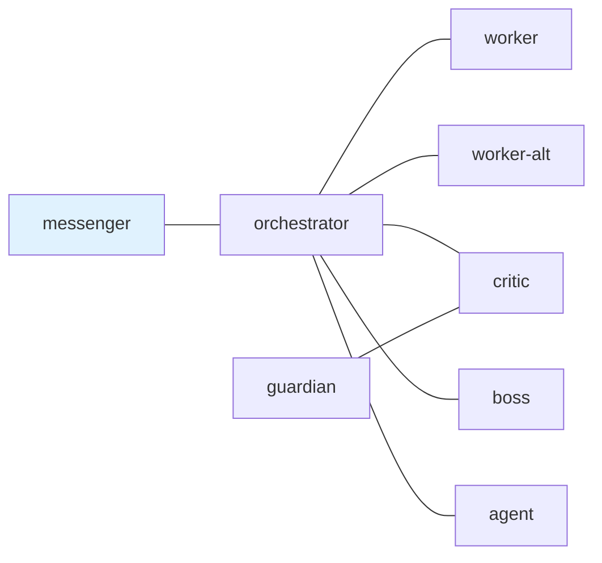

## 1. はじめに

前回の記事では、tmux を AI コーディングエージェント時代のマルチエージェントオーケストレーション基盤として使う話をしました。

@[card](https://zenn.dev/i9wa4/articles/2026-02-08-tmux-intro-ai-agent-orchestration)

今回はその続きとして、tmux 上に並べた複数の AI エージェントへ安全に仕事を渡すために作っている `tmux-a2a-postman` を紹介します。

この記事で伝えたいことは1つです。

エージェントの制御面を、エージェント自身にも人間にも読める Markdown として管理すると、運用がかなり楽になります。

ここでいう制御面とは、ペイン構成そのものではありません。誰が誰に話してよいか、どの役割がどの責務を持つか、返信が必要な仕事をどう閉じるか、レビューや承認をどう流すか、どの Skill を見せるか、といった協調のルールです。

`tmux-a2a-postman` では、その中心を `postman.md` に置いています。

## 2. tmux だけでは足りなくなる部分

tmux はペインを並べ、ペイン名を付け、外部からコマンドで制御できるので、AI エージェントを複数動かす土台としてかなり強いです。

ただし、エージェントが増えると次の問題が出てきます。

- どのペインにどの役割を任せたのか分かりづらい
- あるエージェントへの依頼が読まれたのか分かりづらい
- 返信が必要な依頼が未完了のまま流れやすい
- `tmux send-keys` で直接入力すると、履歴や意図が残りにくい
- Claude Code、Codex CLI、その他 CLI エージェントを同じ扱いにしづらい
- レビューや承認の流れがチャット上の約束だけになりやすい

前回の記事で紹介したように、tmux は画面と実行環境を扱うのが得意です。一方で、複数エージェント間の手紙、返信待ち、役割、承認ルートまでは標準機能として持っていません。

そこで、tmux のペインをそのまま使いながら、ペイン間の通信と状態管理だけを薄く足す発想にしました。

## 3. tmux-a2a-postman の概要

`tmux-a2a-postman` は、tmux 上の AI エージェント同士にメッセージを配送するローカルデーモンです。

基本的な考え方は単純です。

- tmux のペインタイトルを role や node の名前として扱う
- `send-heredoc` で相手の inbox に Markdown の手紙を送る
- 受信側は `pop` で手紙を claim して read archive に移す
- 返信が必要な手紙には `input_request_id` を付ける
- 返信側は `--fills-input-request-id` でその依頼を閉じる
- `get-status` で誰が待っていて誰が返信すべきかを見る

人間から見ると、tmux の画面はそのままです。Claude Code のペインも Codex CLI のペインも、pane title が `worker` なら postman 上は `worker` として扱われます。

エージェントから見ると、自分の inbox に手紙が届き、必要なら返信コマンドまで本文末尾に出ます。ローカルのファイルシステムにメッセージが残るので、後から読み返しやすいのも重要です。

もう少し実装寄りに言うと、daemon は現在の Unix user ごとに1つ起動する想定です。daemon 自身がどの tmux セッションやペインにいるかには依存せず、tmux の pane metadata を見て node を発見します。一方で、同じ tmux セッションを複数 daemon が同時に所有しないように、session ownership は排他的に扱います。

メッセージの実体は state directory 配下のファイルです。既定では `$XDG_STATE_HOME/tmux-a2a-postman`、なければ `~/.local/state/tmux-a2a-postman` の下に、context と tmux session ごとの `post/`、`inbox/{node}/`、`read/`、`dead-letter/` ができます。CLI ではこのファイル構造を直接触るのではなく、`send-heredoc`、`pop`、`inspect-*` を通して扱います。

## 4. postman.md を設定ファイルにする

実際の設定は `../dotfiles/config/tmux-a2a-postman/postman.md` に置いています。

最小構成では、Mermaid で通信可能なノード同士をつなぐだけでも動きます。



この図はドキュメントではなく、実際に daemon が読む設定です。

`messenger` は人間に近い入口、`orchestrator` はタスク分解と配送、`worker` は実装、`critic` と `guardian` はレビュー、`boss` は最終承認、というように役割を分けています。

Mermaid の `class messenger ui_node` は、人間が最初に話すノードを表します。図として読めるだけでなく、起動時の PING 先としても使われます。

ここで使っている edge は `---` の双方向エッジです。`postman.md` の parser は Mermaid を一般的な描画情報として全部解釈するわけではなく、`graph`、`classDef`、`style` などの図示用 statement は読み飛ばし、node id と `---` の関係だけを配送ルールとして取り出します。そのため、図としての見やすさを保ちながら、protocol 名としての node id も同時に管理できます。

Markdown の中には共通テンプレートやノード別テンプレートも書けます。たとえば私の設定では、共通テンプレートに次のような運用ルールを入れています。

- messenger 以外はユーザーへ直接質問しない
- approval 前に成果物を検証する
- DONE には task artifact と evidence を含める
- reply-required な依頼は `input_request_id` を正確に閉じる
- public な GitHub 面にはローカル絶対パスを書かない

これらはエージェントへのプロンプトでもありますが、人間がレビューできる運用規約でもあります。ここが Markdown に寄せた一番大きい理由です。

設定の読み込みは、組み込みデフォルト、XDG 配下の設定、project-local の `.tmux-a2a-postman/` 配下の設定、という順に重ねます。数値やタイミングの既定値は `postman.toml` 向きですが、topology と role contract は `postman.md` 向きです。最小構成なら `postman.toml` は不要で、Mermaid edges だけの `postman.md` でも node は自動的に materialize されます。

## 5. Markdown を制御面にする理由

設定ファイルというと TOML や YAML に寄せたくなります。実際、数値や真偽値のデフォルトは TOML の方が扱いやすいです。

一方で、エージェントの協調ルールは構造化データだけでは表しづらいです。

たとえば、次のような内容は人間にもエージェントにも自然文として読めた方がよいです。

- この node は何をする役割なのか
- どの条件で DONE と言ってよいのか
- どの順序でレビューへ回すのか
- どのエラーは即 BLOCKED として返すのか
- どの Skill を参照してから作業するのか

Markdown なら、設定値、Mermaid の topology、自然文の role contract、チェックリスト、参照リンクを1つのファイルに置けます。

さらに普通のコードレビューで差分を見られます。エージェントの行動を変える変更が、プロンプト管理ツールの奥ではなく、普段見ている Git の差分に出てくるわけです。

これは思った以上に効きます。

## 6. 手紙としてのメッセージ

postman のメッセージは、基本的に Markdown の手紙です。

送信は次のように行います。

```sh
tmux-a2a-postman send-heredoc --to worker <<'POSTMAN_BODY'
実装タスクをここに書く
POSTMAN_BODY
```

quoted heredoc にしているのは、本文中のバッククォート、ドル記号、コードフェンス、シェル例を壊さないためです。エージェントへ渡すメッセージは長くなりがちなので、引数文字列として渡すより安全です。

実際、`send` の argv body は無効化していて、通常の送信経路は `send-heredoc` に寄せています。AI エージェントへの依頼文には `$(...)`、`$HOME`、バッククォート、コードフェンスが頻繁に出るので、shell expansion を避けるために quoted delimiter を必須の作法にしています。

返信が必要な場合は `--reply-required` を付けます。すると送信側は `waiting_on_input`、受信側は `input_required` として見えるようになります。

逆に、返事が不要な通知は `--no-reply` で明示できます。通常の送信は no-reply として扱われ、`DONE`、`ACK`、`PING`、`HEARTBEAT_OK` のような終端メッセージも reply-required を新しく開きません。

返信側は footer に出るコマンドのように `--fills-input-request-id` を付けて返します。

```sh
tmux-a2a-postman send-heredoc --to orchestrator --fills-input-request-id ireq_example --reply-to 20260507-example.md <<'POSTMAN_BODY'
DONE: 実装と検証が完了しました
POSTMAN_BODY
```

この仕組みによって、ただ返事をした気分になるのではなく、どの依頼を閉じたのかが状態として残ります。ただし、`--fills-input-request-id` が閉じるのは transport 上の返信待ちです。タスクが本当に終わったかどうかは、task artifact、元のチェックリスト、実行した検証、残ブロッカーなし、という証拠を別に確認します。

`pop` は inbox の最古の未読メッセージを claim して `read/` に移し、JSON で `message_id`、frontmatter、archive 済み Markdown の path、残り未読数などを返します。本文を標準出力に丸ごと出さないのは、長い手紙やコードブロックを CLI の制御出力と混ぜないためです。本文を読みたい agent は、返ってきた `markdown_absolute_path` を開きます。

`inspect-message --id <message_id>` は read archive だけでなく、現在の context と tmux session にある unread inbox と read archive の両方を探す read-only 操作です。`--path` や `--body` を付けると、該当する Markdown path や本文だけを取り出せます。まだ開いている reply-required な依頼だけを確認したい場合は、inbox を消費しない `inspect-input --id <message_id-or-input_request_id>` を使います。この2つを分けることで、「未読を claim する操作」と「状態を調べる操作」が混ざらないようにしています。

## 7. 状態を見られるようにする

複数エージェント運用で怖いのは、誰かが黙っていることそのものではありません。

怖いのは、待ってよい沈黙なのか、こちらが対応すべき未読なのか、配送が詰まっているのかを区別できないことです。

`tmux-a2a-postman get-status` は、この区別を JSON で返します。人間がざっと見るときは次のような one-line 表示も使えます。

```sh
tmux-a2a-postman get-status-oneline --severity
```

状態としては、たとえば次のようなものがあります。

| 状態               | 意味                         |
| ------------------ | ---------------------------- |
| `ready`            | すぐ対応すべき入力はない     |
| `pending`          | 受信側に返信すべき依頼がある |
| `waiting`          | 送信側が返信を待っている     |
| `blocked`          | BLOCKED 報告が開いている     |
| `delivery_stuck`   | 配送キューが詰まっている     |
| `delivery_failure` | dead-letter が存在する       |

この状態があると、orchestrator は worker を待つべきか、follow-up すべきか、messenger に詰まりを返すべきかを判断しやすくなります。

現在の `get-status` は `schema_version: 3` の session health contract を返します。`visible_state` は `ready`、`waiting`、`pending`、`stale` のような見た目の状態を表し、`severity` は `ok`、`working`、`expected_wait`、`needs_action`、`blocked`、`attention_stale`、`delivery_stuck`、`delivery_failure` のような対応優先度を表します。

ここを分けているのが重要です。たとえば worker が黙っていても、送信側が reply-required の返事を待っているだけなら `expected_wait` です。一方、worker 側に開いた `input_required` が残っていれば `needs_action` です。配送キューに古い post が残り続ける場合は `delivery_stuck` になります。沈黙を全部同じ不安として扱わず、待てる沈黙と介入すべき沈黙を分けます。

また、`get-status` には `nodes[*].screen_progress` という非内容ベースの進捗情報もあります。最後に capture した時刻、最後に画面変化を検出した時刻、不透明な fingerprint は出しますが、pane の生テキストは出しません。状態確認に必要な「動いているか」は見せつつ、作業中の本文を health JSON に混ぜないためです。

## 8. Skill catalog を埋め込みすぎない

私の `postman.md` では frontmatter の `skill_path` で Skill の一覧を渡しています。

ここで重要なのは、Skill 本文を全部インライン展開しないことです。

role prompt に長大な手順書をすべて詰め込むと、起動時点でコンテキストが重くなります。postman では、`SKILL.md` の frontmatter から `name` と `description` を拾って、短い catalog として role context に入れます。

エージェントはその一覧を見て、必要な Skill の本文だけを作業前に読みます。

これにより、設定ファイルは「どの知識が利用可能か」を示し、実際の詳細は Skill 側に残せます。Markdown は索引として働き、長い運用知識を無理に1ファイルへ押し込まなくて済みます。

さらに、`skill_path` には通常の role context に入れる catalog と、compaction 後の recovery PING だけに入れる catalog を分ける仕組みがあります。`inject: ping` を付けた catalog は普段のメッセージには入らず、pane capture が Claude Code や Codex CLI の context compaction marker を見つけたときの PING にだけ足されます。

この検出は visible pane だけではなく、最近の scrollback も対象にできます。既定では `pane_capture_tail_lines = 100` で直近100行を見ます。`0` にすると visible pane だけに戻せます。`inject: ping` の catalog は compaction 後に別の作業ディレクトリへ届く可能性があるので、repo-relative ではなく `~/...` や absolute path のような user/global path に寄せています。

これにより、普段は軽い role prompt のままにしつつ、コンテキスト圧縮後には「この環境で使える Skill は何か」を再注入できます。`runtime: claude` と `runtime: codex` を分けられるので、Claude Code と Codex CLI で Skill の置き場所や名前が違う場合にも対応しやすくなります。

## 9. 先行事例から見た位置づけ

調べた範囲では、近い問題に対するアプローチはいくつかあります。

まず、YAML で tmux のレイアウトを定義する方式があります。これは環境を一発で立ち上げる用途にはとても強いです。一方で、ペインが起動した後の依頼、返信待ち、レビュー順、承認条件までは別の仕組みが必要になります。

次に、`send-keys` を直接使う方式があります。これは最小構成では強力です。ただし、どの依頼が読まれたか、どの返信で閉じたか、どのメッセージが未処理かを追うには、自分で規約とログを作る必要があります。

また、単一のエージェント製品に強く依存する方式もあります。1つのランタイム内で完結するなら便利ですが、複数種類の CLI エージェントを同じ tmux セッションに並べたい場合や、ローカルのペイン運用をそのまま使いたい場合には制約になりやすいです。

Web/API 中心のマルチエージェントフレームワークもあります。アプリケーションとしてエージェントを組み込むなら自然な選択です。一方で、日々の開発中にすでに開いている tmux ペインへ仕事を配るだけなら、少し大きすぎることがあります。

作業単位ごとに新しいセッションを作る方式もあります。分離はしやすいですが、長く生きる作業場としての tmux セッション、ペインごとの専門役割、継続的なレビュー待ちを扱うには、やはり別の状態管理が必要になります。

`tmux-a2a-postman` は、これらを置き換えるものではありません。担当する層が違います。

レイアウト、エージェント本体、LLM API、IDE 統合を作るのではなく、すでに tmux 上で動いている複数のエージェントへ、読める手紙と閉じられる返信待ちを足すための道具です。

## 10. 実運用でうれしい点

実際に運用してみると、特に効くのは次の点です。

- 普通の Markdown 差分として role contract をレビューできる
- Mermaid topology がそのまま配送ルールになる
- inbox と read archive がファイルとして残る
- reply-required な依頼が状態として見える
- Claude Code と Codex CLI を pane title だけで同じ role にできる
- dotfiles の共通設定と project-local override を併用できる
- Skill catalog により初期コンテキストを増やしすぎずに済む
- `get-status` で待ち、未読、詰まり、ブロックを区別できる
- tmux の普段の作業スタイルを置き換えずに済む

地味ですが、どれも長時間のマルチエージェント作業では効いてきます。

特に「返信が必要な依頼が開いている」という状態を機械的に扱えるだけで、作業の取りこぼしがかなり減ります。

## 11. A2A との関係

名前に `a2a` と入っていますが、現時点の `tmux-a2a-postman` は A2A Protocol 準拠のサーバーではありません。

HTTP エンドポイントや Agent Card discovery を提供しているわけではなく、`send-heredoc` がそのまま A2A の `SendMessage` になるわけでもありません。

ここでやっているのは、A2A の用語や考え方のうち、ローカル tmux 運用にも役立つ部分を尊重することです。たとえば message、context、artifact、input-required のような考え方は、ローカルの手紙、task artifact、reply-required 状態を説明するのに相性がよいです。

ただし、正直に境界を分けるのが大事です。

postman は tmux とファイルシステムに寄せたローカル調整ランタイムです。将来的に外部プロトコルへ寄せる余地はありますが、今は「A2A 風の語彙を使う tmux 用 postman」と理解するのが正確です。

この境界を明示しているのは、過大に見せないためでもあります。`get-status` は A2A の `GetTask` ではありませんし、`send-heredoc` は A2A の `SendMessage` ではありません。postman が持っているのは、local daemon、Markdown envelope、filesystem mailbox、reply-required の input request projection です。この範囲に閉じているから、既存の tmux 作業場に薄く差し込めます。

## 12. 使い始める流れ

前提は macOS または Linux と tmux 3.0 以上です。インストールは Go なら `go install github.com/i9wa4/tmux-a2a-postman@latest`、Nix なら `nix run github:i9wa4/tmux-a2a-postman` で試せます。CLI は明示的な subcommand 前提で、裸の `tmux-a2a-postman` は daemon を起動せず usage を表示します。

大まかな流れは次の通りです。

1. tmux セッションに `messenger`、`orchestrator`、`worker` などの pane title を付けたペインを用意する
2. `postman.md` に Mermaid の edges と role template を書く
3. `tmux-a2a-postman start` で daemon を起動する
4. 受信した PING を各ペインで `pop` して役割を読む
5. messenger から orchestrator へ依頼し、orchestrator が worker へ `--reply-required` で投げる
6. worker は task artifact と evidence を残して DONE または BLOCKED を返す
7. critic、guardian、boss を通して必要なレビューと承認を流す

最初から全ノードを使う必要はありません。まずは `messenger`、`orchestrator`、`worker` だけで十分です。

それでも、直接 `send-keys` するよりも「誰に何を依頼して、どの返信で閉じたか」が残るので、運用の見通しはかなり良くなります。

## 13. まとめ

tmux は、複数の AI エージェントを同時に動かすための良い土台です。

ただし、ペインを並べるだけでは、エージェント同士の依頼、返信待ち、レビュー、承認、Skill 参照までは管理できません。

`tmux-a2a-postman` は、その不足分を Markdown の設定ファイルと filesystem-backed inbox で補います。

ポイントは、Markdown を単なるドキュメントではなく、実際に daemon が読む制御面として扱うことです。Mermaid は topology になり、role template はエージェント契約になり、reply-required は閉じられる状態になります。

前回の記事で tmux をマルチエージェントオーケストレーションの土台として紹介しました。この記事では、その上に「手紙」と「返信待ち」と「読める設定」を足す方法を紹介しました。

次は、実際の運用例や approval lane の回し方をもう少し具体的に掘り下げたいと思います。

## 14. 参考リンク

@[card](https://github.com/i9wa4/tmux-a2a-postman)

@[card](https://github.com/i9wa4/dotfiles/blob/main/config/tmux-a2a-postman/postman.md)

@[card](https://github.com/tmux/tmux/wiki)

@[card](https://github.com/a2aproject/A2A/blob/main/docs/specification.md)
