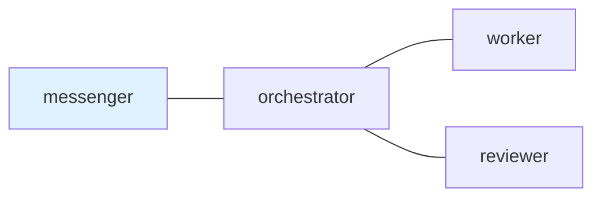

## 1. はじめに

tmux 上で Claude Code や Codex CLI を複数起動して、実装用、レビュー用、調査用のように分けて使うことが増えてきました。

ペインを並べるだけなら tmux や vde-layout でかなり楽になります。

ただ、実際に複数の AI エージェントを動かしていると別の問題が出ます。

- どのエージェントに何を頼んだか分からなくなる
- 返事待ちの依頼を見落とす
- レビュー依頼が終わったのか曖昧になる
- ターミナルのスクロールバックを後から探すことになる

このあたりをどうにかするために `tmux-a2a-postman` を作っています。

@[card](https://github.com/i9wa4/tmux-a2a-postman)

ざっくり言うと、tmux 上の AI エージェント同士の依頼を Markdown のメッセージとして残すためのツールです。

## 2. ペインを増やした後に困ること

以前、AI エージェント時代の作業場として tmux を使う話を書きました。

@[card](https://zenn.dev/i9wa4/articles/2026-02-08-tmux-intro-ai-agent-orchestration)

tmux はかなり便利です。

セッションを残せるし、ペインも分けられるし、外から入力も送れます。AI エージェントを複数並べる土台としてはかなり使いやすいです。

一方で、tmux は「誰に何を頼んで、誰が返事待ちか」を管理するためのツールではありません。

最初はペイン名やメモでなんとかなるのですが、依頼が増えてくるとだんだん怪しくなります。

たとえば、次のような作業です。

- 実装担当に修正を依頼する
- レビュー担当に差分を見てもらう
- 返事が必要なものだけ DONE / BLOCKED で返してもらう
- 最後に人間へ報告できる形にまとめる

これを全部チャット履歴と人間の記憶で管理するのはつらいです。

## 3. postman でやっていること

`tmux-a2a-postman` がやっていることはそこまで大げさではありません。

送信側が Markdown のメッセージを書き、宛先の `inbox` に置きます。受信側は `pop` でそれを取り出し、読んだものは `read archive` に移ります。

返事が必要な依頼には ID が付きます。受信側は作業が終わったら `DONE`、詰まったら `BLOCKED` で返します。

つまり、やりたいことはこれです。

| 困ること                     | postman での扱い                    |
| ---------------------------- | ----------------------------------- |
| 何を頼んだか忘れる           | Markdown のメッセージとして残る     |
| 誰が読んだか分からない       | `inbox` と `read archive` で分かる  |
| 返事待ちを見落とす           | 返事が必要な依頼として残る          |
| ペインごとの役割が曖昧になる | `postman.md` に担当ごとの説明を書く |
| 後から確認できない           | ローカルのファイルとして追える      |

AI エージェントを賢くするツールではありません。

依頼と返事待ちを、ターミナルの表示ではなくローカルの状態として残すためのツールです。

## 4. 依頼は Markdown のまま送る

依頼はシェルから送れます。

```sh
tmux-a2a-postman send-heredoc --to worker <<'POSTMAN_BODY'
この記事を読み、分かりにくい表現を直してください。
変更したファイルと確認した内容も返してください。
POSTMAN_BODY
```

quoted heredoc にしているのは、本文の中にバッククォートや `$HOME`、`$(...)`、コードフェンスが入ってもシェルに壊されないようにするためです。

AI エージェントへの依頼は長くなりがちなので、ここは地味に効きます。

受け取る側は `pop` で読みます。

```sh
tmux-a2a-postman pop
```

これで inbox から取り出され、読んだメッセージとして保存されます。

## 5. postman.md に運用ルールを書く

宛先や担当ごとの説明は `postman.md` に書きます。

たとえば最小構成だと次のようなイメージです。

````markdown:postman.md
## `edges`



## `common_template`

依頼の受け渡しは postman mail を使う。
返事が必要な作業は DONE または BLOCKED で返す。

## `messenger`

人間との窓口。
依頼は orchestrator に渡し、最終報告だけ返す。

## `orchestrator`

段取り担当。
worker に実装を頼み、必要なら reviewer に確認を頼む。

## `worker`

実装担当。
変更したファイル、検証結果、残った問題を返す。

## `reviewer`

レビュー担当。
問題があれば理由を添えて返す。
````

Mermaid の図は見た目だけではなく、どの名前のペインからどの名前のペインへ送れるかの設定にもなります。

最低限は `edges` という backtick 付きの H2 セクションと Mermaid の `---` だけでもトポロジーとして動きます。`common_template` は全員に渡す共通ルール、`worker` や `reviewer` のセクションはその役割にだけ渡す説明です。

この手の運用ルールを普通の Markdown として持てるのが気に入っています。差分で見られるし、AI エージェントにもそのまま読ませやすいです。

## 6. 実際にタスクを受け渡す

README の quickstart では、`messenger`、`orchestrator`、`worker`、`reviewer` のような小さなチームを例にしています。

この構成では、人間に近い入口を `messenger` にして、実装の段取りは `orchestrator`、実作業は `worker`、確認は `reviewer` に寄せます。`postman.md` の `edges` に `messenger --- orchestrator` と `orchestrator --- worker` があるので、`messenger` は `worker` に直接投げず、いったん `orchestrator` に渡します。

たとえば `orchestrator` から `worker` に実装を頼むときは、普通の Markdown として送ります。

```sh
tmux-a2a-postman send-heredoc --to worker --reply-required <<'POSTMAN_BODY'
記事の status 記号の説明を実装に合わせて確認し、必要なら修正してください。
変更したファイル、確認したソース、残った問題を返してください。
POSTMAN_BODY
```

`worker` は通知を受けたら `pop` で読み、完了後に元の依頼へ返します。

```sh
tmux-a2a-postman pop

tmux-a2a-postman send-heredoc \
  --to orchestrator \
  --reply-to <message-id> \
  --fills-input-request-id <input-request-id> <<'POSTMAN_BODY'
DONE: status 記号の説明を修正しました。
Task artifact: <artifact-reference>
Original checklist: PASS
Evidence: README と実装の状態定義を確認しました。
Remaining blockers: none
POSTMAN_BODY
```

必要なら `orchestrator` は同じように `reviewer` へレビューを依頼し、最後に `messenger` へ報告します。

ここでやっているのはチャット UI の再現ではありません。`postman.md` で「誰が誰に送れるか」と「各役割が何を返すか」を決め、実際の依頼と返事は Markdown のメールとして残す、というだけです。

## 7. 状態を確認する

複数の AI エージェントを動かしていて一番困るのは、黙っている理由が分からないことです。

まだ作業中なのか、返事待ちなのか、そもそも依頼を読んでいないのかを区別したくなります。

`tmux-a2a-postman get-status` ではその状態を確認できます。

```sh
tmux-a2a-postman get-status
```

短い表示だけ見たいときは `get-status-oneline` もあります。

```sh
tmux-a2a-postman get-status-oneline
```

実際に手元で実行すると、たとえば次のように出ます。

```console
$ tmux-a2a-postman get-status-oneline
[0]⚫ [1]🟢:🟢🟢🟢🟢🟢🟢 [2]🟡:🔷🔷🟢🔷🟡🟢 [3]🟡:🔷🔷🔷🟢🟢🟢 [4]🟡:🔷🔷🟢🟢🟢🟢 [5]🟡:🔷🟢🟢🟢🟢🟢 [6]🟡:🔷🟢🟢🔷🟢🟢
```

`tmux-a2a-postman start` で立ち上がる TUI も、同じ状態を人間向けに見せています。手元の表示を公開用にセッション名だけ置き換えると、次のような感じです。

```text
tmux-a2a-postman git-7c520a4   [up/down:move] [p:ping] [q:quit]

[sessions]
  ⚫ [0] shell
  🟢 [1] dotfiles
> 🔷 [2] work-session

[nodes]
messenger     🟡  waiting
orchestrator  🔷  pending
worker        🔷  pending
reviewer      🟢  ready
```

`🔷` は、そのノードに未解決の reply-required な受信依頼がある状態です。`🟡` は、そのノードが送った reply-required な依頼の返事待ち、`🟢` は未処理の依頼や返事待ちがない状態、`⚫` はまだライブ状態の根拠がない初期状態を表します。

見たいのはエージェントの思考内容ではありません。

誰に未読があるか、誰が返事待ちか、どこかで `BLOCKED` が残っていないかです。

ペインをじっと眺めるのではなく、受け渡しの状態だけを確認できるようにしておくと、複数エージェント運用がかなり楽になります。

## 8. Agent Skills との相性

Agent Skills も `postman.md` から参照できます。

毎回長い手順を全部プロンプトに入れるのではなく、使える Skill の名前と説明だけを渡しておき、必要になったときに `SKILL.md` を読む形にしています。

これにより、Claude Code と Codex CLI のように別の CLI ツールを同じ tmux セッションに並べても、同じ担当名と同じ運用ルールで扱いやすくなります。

## 9. 何ではないか

`tmux-a2a-postman` は AI コーディングエージェント本体ではありません。

Claude Code や Codex CLI の代替でもありません。tmux や vde-layout の代わりにペインを作るツールでもありません。

また、名前に `a2a` と入っていますが、現時点では A2A Protocol 準拠のサーバーではありません。

やっているのは、tmux 上のペイン同士で Markdown のメッセージを受け渡し、未読、既読、返事待ち、状態確認を扱えるようにすることです。

## 10. まとめ

tmux 上に Claude Code や Codex CLI を複数並べると、作業を分担しやすくなります。

ただ、依頼や返事待ちまで人間が覚えておく運用はつらいです。

`tmux-a2a-postman` は、その部分を Markdown のメッセージとして残します。

ペインを増やすためのツールではなく、増やした後の受け渡しを扱うためのツールです。

複数の CLI エージェントを日常的に使うなら、このくらいの薄い層があるとかなり運用しやすくなると思っています。
