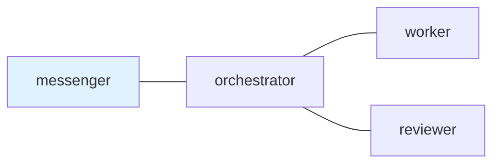
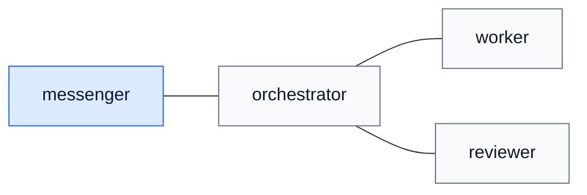

## 1. はじめに

tmux 上で Claude Code や Codex CLI を複数起動して、実装用、レビュー用、調査用のように分けて使うことが増えてきました。

ペインを並べるだけなら tmux や vde-layout でかなり楽になります。

ここでの vde-layout は、AI エージェント用の tmux ペイン配置を同じ形で用意し直すための道具です。

@[card](https://zenn.dev/i9wa4/articles/2026-02-08-tmux-intro-ai-agent-orchestration)

ただ、実際に複数の AI エージェントを動かしていると別の問題が出ます。

- どのエージェントに何を頼んだか分からなくなる
- 返事待ちの依頼を見落とす
- レビュー依頼が終わったのか曖昧になる
- ターミナルのスクロールバックを後から探すことになる

このあたりをどうにかするために tmux-a2a-postman を作っています。

@[card](https://github.com/i9wa4/tmux-a2a-postman)

ざっくり言うと、Markdown を設定ファイルとして使い、tmux 上の AI エージェント同士の依頼リレーを Markdown のメッセージとして残すためのツールです。

## 2. ペインを増やした後に困ること

以前、AI エージェント時代の作業場として tmux を使う話を書きました。

tmux はかなり便利です。

セッションを残せるし、ペインも分けられるし、外から入力も送れます。AI エージェントを複数並べる土台としてはかなり使いやすいです。

一方で、tmux は「誰に何を頼んで、誰が返事待ちか」を管理するためのツールではありません。

最初はペイン名やメモでなんとかなるのですが、依頼が増えてくるとだんだん怪しくなります。

たとえば、次のような作業です。

- 実装担当に修正を依頼する
- レビュー担当に差分を見てもらう
- 返事が必要なものだけ DONE / BLOCKED で返してもらう
- 最後に人間へ報告できる形にまとめる

これを全部チャット履歴と人間の記憶で管理するのはつらいです。

## 3. tmux-a2a-postman でやっていること

仕組みはシンプルです。tmux 上の依頼を Markdown とローカル状態に分けて残します。

送信側は Markdown のメッセージを宛先の `inbox` に置きます。受信側は `pop` で取り出し、読んだものは `read archive` に移ります。

返事が必要な依頼には ID が付きます。受信側は作業が終わったら `DONE`、詰まったら `BLOCKED` で返します。

つまり、やりたいことはこれです。

| 困ること                     | tmux-a2a-postman での扱い           |
| ---------------------------- | ----------------------------------- |
| 何を頼んだか忘れる           | Markdown のメッセージとして残る     |
| 誰が読んだか分からない       | `inbox` と `read archive` で分かる  |
| 返事待ちを見落とす           | 返事が必要な依頼として残る          |
| ペインごとの役割が曖昧になる | `postman.md` に担当ごとの説明を書く |
| 後から確認できない           | ローカルのファイルとして追える      |

AI エージェントを賢くするツールではありません。

依頼と返事待ちを、ターミナルの表示ではなくローカルの状態として残すためのツールです。

## 4. 依頼は Markdown のまま送る

依頼はシェルから送れます。

```sh
tmux-a2a-postman send-heredoc --to worker <<'POSTMAN_BODY'
この記事を読み、分かりにくい表現を直してください。
変更したファイルと確認した内容も返してください。
POSTMAN_BODY
```

quoted heredoc にしているのは、本文の中にバッククォートや `$HOME`、`$(...)`、コードフェンスが入ってもシェルに壊されないようにするためです。

AI エージェントへの依頼は長くなりがちなので、ここは地味に効きます。

受け取る側は `pop` で読みます。

```sh
tmux-a2a-postman pop
```

これで inbox から取り出され、既読扱いになります。

## 5. postman.md に運用ルールを書く

`postman.md` は、宛先や担当ごとの説明を書く Markdown の設定ファイルです。

たとえば最小構成だと次のようなイメージです。

````markdown:postman.md
## `edges`



## `common_template`

依頼の受け渡しは tmux-a2a-postman の mail を使う。
返事が必要な作業は DONE または BLOCKED で返す。

## `messenger`

人間との窓口。
依頼は orchestrator に渡し、最終報告だけ返す。

## `orchestrator`

段取り担当。
worker に実装を頼み、必要なら reviewer に確認を頼む。

## `worker`

実装担当。
変更したファイル、検証結果、残った問題を返す。

## `reviewer`

レビュー担当。
問題があれば理由を添えて返す。
````

同じ edges を図として描くと、次のようになります。



Mermaid の図は見た目だけではなく、どの名前のペインからどの名前のペインへ送れるかの設定にもなります。

最低限は `edges` という backtick 付きの H2 セクションと Mermaid の `---` だけでもトポロジーとして動きます。`common_template` は全員に渡す共通ルールです。`worker` や `reviewer` のセクションは、その役割にだけ渡す説明になります。

実際に `pop` で読む Markdown mail には、送信者の本文だけが入るわけではありません。既定の形では、`Recipient Instructions` に `postman.md` 由来の `common_template` と宛先ごとの説明が入り、`Sender Message` に送信本文が入ります。

`skill_path` を通常の role context として設定している場合は、`SKILL.md` の `name` と `description` から作られた `Available Skills` も同じ受信 mail に入ります。`inject: ping` や `inject: compaction_ping` にしたカタログは、通常の依頼ではなく daemon PING 側に入ります。

この手の運用ルールを普通の Markdown として持てるのが気に入っています。差分で見られるし、AI エージェントにもそのまま読ませやすいです。

## 6. 実際にタスクをリレーする

README の quickstart では、`messenger`、`orchestrator`、`worker`、`reviewer` のような小さなチームを例にしています。

この構成では、人間に近い入口を `messenger` にします。実装の段取りは `orchestrator`、実作業は `worker`、確認は `reviewer` に寄せます。`postman.md` の `edges` に `messenger --- orchestrator` と `orchestrator --- worker` があるので、`messenger` は `worker` に直接投げません。いったん `orchestrator` に渡します。

たとえば `orchestrator` から `worker` に実装を頼むときは、普通の Markdown として送ります。

```sh
tmux-a2a-postman send-heredoc --to worker --reply-required <<'POSTMAN_BODY'
記事の status 記号の説明を実装に合わせて確認し、必要なら修正してください。
変更したファイル、確認したソース、残った問題を返してください。
POSTMAN_BODY
```

`worker` は通知を受けたら `pop` で読み、完了後に元の依頼へ返します。

```sh
tmux-a2a-postman pop

tmux-a2a-postman send-heredoc \
  --to orchestrator \
  --reply-to <message-id> \
  --fills-input-request-id <input-request-id> <<'POSTMAN_BODY'
DONE: status 記号の説明を修正しました。
Task artifact: <artifact-reference>
Original checklist: PASS
Evidence: README と実装の状態定義を確認しました。
Remaining blockers: none
POSTMAN_BODY
```

もう少し引いて見ると、タスクのリレーは次のように流れます。これは Markdown mail の受け渡しを説明するための例です。

```text
user -> messenger: 記事に Agent Skills の説明を足してほしい

messenger -> orchestrator: 依頼を整理して作業担当へ渡す

orchestrator -> worker: 本文を更新し、変更ファイルと確認結果を返す

worker -> orchestrator: DONE: raw article を更新、checks passed

orchestrator -> reviewer: 要求どおりか確認して

reviewer -> orchestrator: BLOCKED: Skill 名の根拠が不足している

orchestrator -> worker: 根拠を追記して再確認して

worker -> orchestrator: DONE: README と SKILL.md を確認済み

orchestrator -> messenger: DONE: commit と検証結果をまとめる

messenger -> user: 記事を更新しました
```

## 7. 状態を確認する

複数の AI エージェントを動かしていて一番困るのは、黙っている理由が分からないことです。

まだ作業中なのか、返事待ちなのか、そもそも依頼を読んでいないのかを区別したくなります。

`tmux-a2a-postman get-status` ではその状態を確認できます。

```sh
tmux-a2a-postman get-status
```

短い表示だけ見たいときは `get-status-oneline` もあります。

```sh
tmux-a2a-postman get-status-oneline
```

実際に手元で実行すると、たとえば次のように出ます。

```console
$ tmux-a2a-postman get-status-oneline
[0]⚫ [1]🟢:🟢🟢🟢🟢🟢🟢 [2]🟡:🔷🔷🟢🔷🟡🟢 [3]🟡:🔷🔷🔷🟢🟢🟢 [4]🟡:🔷🔷🟢🟢🟢🟢 [5]🟡:🔷🟢🟢🟢🟢🟢 [6]🟡:🔷🟢🟢🔷🟢🟢
```

`tmux-a2a-postman start` で立ち上がる TUI も、同じ状態を人間向けに見せています。手元の表示を公開用にセッション名だけ置き換えると、次のような感じです。

```text
tmux-a2a-postman git-7c520a4   [up/down:move] [p:ping] [q:quit]

[sessions]
  ⚫ [0] shell
  🟢 [1] dotfiles
> 🔷 [2] work-session

[nodes]
messenger     🟡  waiting
orchestrator  🔷  pending
worker        🔷  pending
reviewer      🟢  ready
```

`🔷` は、そのノードに未解決の reply-required な受信依頼がある状態です。`🟡` は、そのノードが送った reply-required な依頼の返事待ちです。`🟢` は未処理の依頼や返事待ちがない状態です。`⚫` は初期状態です。

見たいのはエージェントの思考内容ではありません。

誰に未読があるか、誰が返事待ちか、どこかで `BLOCKED` が残っていないかです。

これは人間が見るためだけではありません。Agent Skills の `postman-session-operator` を読んだエージェントも、この状態をもとに未読の claim、既読アーカイブの確認、正しい input request への返信、詰まりや dead-letter の報告を選べます。

ペインをじっと眺めるのではなく、受け渡しの状態だけを確認できるようにしておくと、複数エージェント運用がかなり楽になります。

## 8. 忘れにくくする仕組み

複数のエージェントを動かしていて困るのは、単にメッセージを送れるかどうかではありません。

長い作業の途中では、担当のずれ、reply-required な依頼の閉じ忘れ、使えるローカル手順の忘れ落ちが起きます。

tmux-a2a-postman では、それを三つの形で残します。

`postman.md` 由来の共通ルールや宛先ごとの説明は受信 mail に入ります。通常の `skill_path` カタログを設定している場合は、使える Skill 名と短い説明も同じ場所に入ります。reply-required な依頼は閉じていないループとして状態に残ります。

つまり、誰として動くか、何を返す必要があるか、どのローカル手順を使えるかをターミナルの記憶だけに寄せないようにしています。

## 9. tmux-a2a-postman 用の Agent Skills

tmux-a2a-postman 自身を使うための Agent Skills も用意しています。

- `postman-send-message` は、最初のメッセージを安全に送るための Skill
- `postman-session-operator` は、受信、既読アーカイブ、返事待ち、状態確認を扱うための Skill
- `postman-config-auditor` は、`postman.md` の経路やロール定義、設定のずれを確認するための Skill

これらは tmux-a2a-postman を使う・運用する・設定を確認するための補助です。毎回長い手順を全部プロンプトに入れるのではなく、必要になったときに `SKILL.md` を読む形にしています。

そうしておくと、`postman.md` は役割とリレーの流れに集中させ、細かい使い方や監査手順は Skill 側に逃がせます。

これにより、Claude Code と Codex CLI のように別の CLI ツールを同じ tmux セッションに並べても、同じ担当名と同じ運用ルールで扱いやすくなります。

ツールそのものだけではなく、エージェントが正しく使うための説明も一緒に配る。今の CLI エージェント運用ではかなり大事な点だと思っています。

## 10. 何ではないか

tmux-a2a-postman は AI コーディングエージェント本体ではありません。

Claude Code や Codex CLI の代替でもありません。tmux や vde-layout の代わりにペインを作るツールでもありません。

tmux-a2a-postman は、A2A Protocol の語彙やデータモデルの形を、ローカルな状態やメッセージの説明に役立つ範囲で借りています。ただし現時点では、A2A Protocol 準拠のサーバーではありません。

やっているのは tmux 上のペイン同士で Markdown のメッセージを受け渡し、未読や既読、返事待ち、状態確認を扱えるようにすることです。

## 11. まとめ

tmux 上に Claude Code や Codex CLI を複数並べると、作業を分担しやすくなります。

ただ、依頼や返事待ちまで人間が覚えておく運用はつらいです。

tmux-a2a-postman は、Markdown の設定ファイルでリレーの流れを決め、その部分を Markdown のメッセージとして残します。

ペインを増やすためのツールではなく、増やした後の受け渡しを扱うためのツールです。

複数の CLI エージェントを日常的に使うなら、このくらいの薄い層があるとかなり運用しやすくなると思っています。
